# 基于激光雷达的封闭园区自动驾驶搭建--感知设备集成
- [基于激光雷达的封闭园区自动驾驶搭建--感知设备集成](#基于激光雷达的封闭园区自动驾驶搭建--感知设备集成)
  - [概览](#概览)
  - [前提条件](#前提条件)
  - [激光雷达安装与数据验证](#激光雷达安装与数据验证)
    - [激光雷达的安装固定](#激光雷达的安装固定)
    - [激光雷达与车辆的接线](#激光雷达与车辆的接线)
      - [1.线缆端口及定义](#1线缆端口及定义)
      - [2.确保整车断电](#2确保整车断电)
      - [3.将端口1(8pin公头)与激光雷达本体上的8pin母头连接](#3将端口18pin公头与激光雷达本体上的8pin母头连接)
      - [4.将激光雷达电源接口(端口4、端口5)接入车上的12V接线盒](#4将激光雷达电源接口端口4端口5接入车上的12v接线盒)
      - [5.将端口2(授时)与IMU的授时端口相连](#5将端口2授时与imu的授时端口相连)
      - [6.将端口3(网线接口)通过网线与工控机相连](#6将端口3网线接口通过网线与工控机相连)
      - [7.再次确认上述安装步骤](#7再次确认上述安装步骤)
    - [激光雷达的配置及启动](#激光雷达的配置及启动)
      - [1.修改工控机IP地址](#1修改工控机ip地址)
    - [激光雷达数据的验证](#激光雷达数据的验证)
      - [1. 编译项目，启动Dreamview](#1-编译项目启动dreamview)
      - [2. 启动所需模块](#2-启动所需模块)
      - [3. 检查lidar数据是否正确](#3-检查lidar数据是否正确)
  - [毫米波雷达安装与数据验证(根据自身需求配置)](#毫米波雷达安装与数据验证根据自身需求配置)
    - [毫米波雷达接口及线序](#毫米波雷达接口及线序)
    - [毫米波雷达的安装固定](#毫米波雷达的安装固定)
    - [毫米波雷达的配置及启动](#毫米波雷达的配置及启动)
    - [毫米波雷达数据的验证](#毫米波雷达数据的验证)
  - [NEXT](#next)
  - [常见问题](#常见问题)
      - [1. 无法打开Lidar配置网页](#1-无法打开lidar配置网页)

## 概览
该用户手册旨在帮助用户完成激光雷达感知设备的安装、集成及数据验证。 

## 前提条件

 - 完成了[循迹搭建--车辆循迹演示](../Waypoint_Following/start_waypoint_following_cn.md)
  
## 激光雷达安装与数据验证
 
 **注意：** 针对Standard、Advanced用户，激光雷达默认已集成好，直接从`激光雷达数据的验证`章节开始进行数据验证即可
 - 激光雷达型号：80-VLP-16（velodyne 16线激光雷达）
 
 - 更多详细参数可参考：[https://velodynelidar.com/vlp-16.html](https://velodynelidar.com/vlp-16.html)
 


### 激光雷达的安装固定

 - 16线激光雷达要牢靠固定安装在车顶部，建议激光雷达对地高度1.5～1.8米，水平放置，精度在2度以内。安装位置如下图：
 


 - 安装激光雷达时线缆方向朝向车辆的正后方。

### 激光雷达与车辆的接线


请按照以下步骤进行激光雷达一拖三线缆的安装。

#### 1.线缆端口及定义

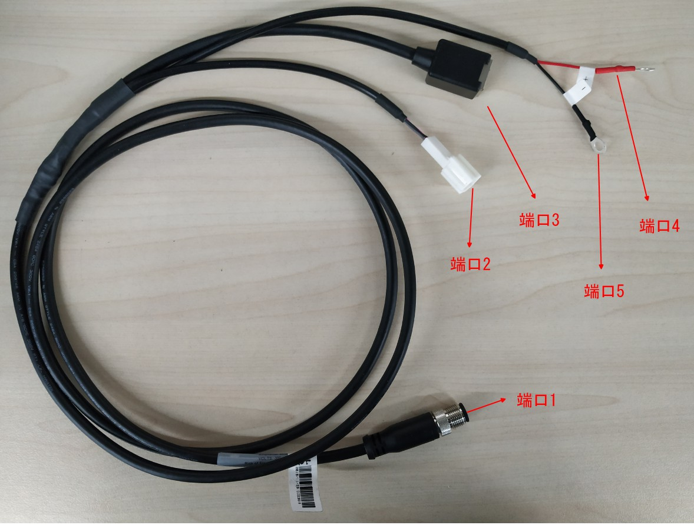

|端口号 | 端口名称 | 
|---|---|
|端口1 | 8pin公头 | 
|端口2 | 授时接口  | 
|端口3 | 网线接口| 
|端口4 | 12V+接口 | 
|端口5 | GND接口 | 

#### 2.确保整车断电

#### 3.将端口1(8pin公头)与激光雷达本体上的8pin母头连接

连接完成后，效果如下图所示：

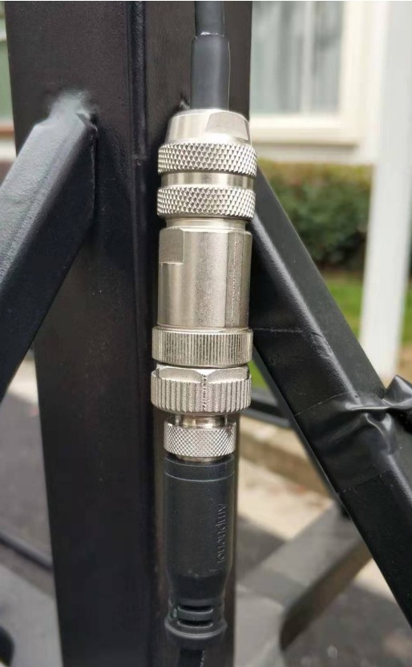

#### 4.将激光雷达电源接口(端口4、端口5)接入车上的12V接线盒

 - 注意：电源接反会烧毁激光雷达
 
 - 将端口4(12V+)接入车上12V电源接线盒的12V+
 
 - 将端口5(GND)接入车上12V电源接线盒的GND

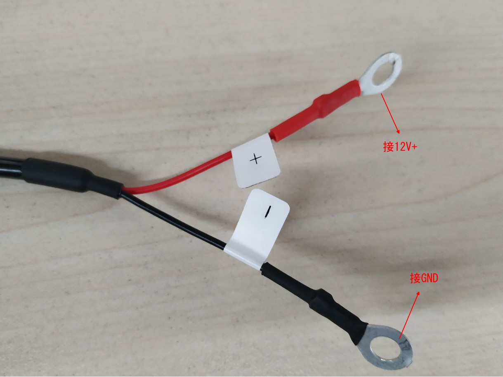

#### 5.将端口2(授时)与IMU的授时端口相连

 - 端口具有防反插功能，请确认正反后再进行连接

#### 6.将端口3(网线接口)通过网线与工控机相连

 - 通过网线，将工控机上的Ethernet接口与端口3连接
 
 - 工控机有两个Ethernet接口，一个用于给工控机上网，一个用于连接激光雷达，用户自行指定即可

#### 7.再次确认上述安装步骤

 - 请务必再次确认正确执行了上述安装步骤，电源线接反会烧毁激光雷达，确认无误后才可以上电，至此激光雷达线束接线完成

### 激光雷达的配置

 
#### 1.修改工控机IP地址

 - 激光雷达的默认IP地址是192.168.1.201，通过网线与工控机Ethernet接口连接，将该Ehternet接口的IP修改为固定IP，且与激光雷达IP处在同一网段，即`192.168.1.xx`，一个示例配置如下图所示：
 
    

 - 激光雷达的相关参数配置：在浏览器中输入激光雷达ip地址，打开激光雷达配置界面， 将`Host IP Address`修改为`255.255.255.255`，将`Data Port`修改为2369，将`Telemetry Port`修改为8309，点击`set` 按键、`Save Configuration`按键保存配置。 
 
    

### 激光雷达数据的验证

####  1. 编译项目，启动Dreamview
进入docker环境，用gpu编译项目，启动DreamView 

    cd /apollo
    bash docker/scripts/dev_start.sh
    bash docker/scripts/dev_into.sh
    bash apollo.sh build_opt_gpu
    bash scripts/bootstrap.sh

####  2. 启动所需模块

- 在浏览器中打开`(http://localhost:8888)`，选择模式为`Dev Kit Debug`， 根据车辆铭牌信息选择对应的车型(详情见下表)，在Module Controller标签页启动GPS、Localization、Transform模块。

  | 铭牌信息 | 车型选择 | 
	|---|---|
	| Apollo D-KIT Lite | dev_kit |
	| Apollo D-KIT Standard  | dev_kit_standard |
	| Apollo D-KIT Advanced(NE-S)| dev_kit_advanced_ne-s |
	| Apollo D-KIT Advanced(SNE-R) | dev_kit_advanced_sne-r  |

  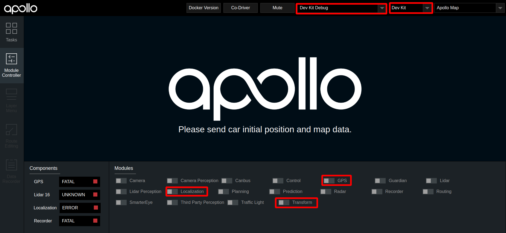

- 定位模块启动后，需要接收定位数据，需要等待约1分钟左右。打开新的终端，并使用`bash docker/scripts/dev_into.sh`命令进入docker环境，在新终端中输入`cyber_monitor`命令查看`tf`、`tf_static`、`/apollo/localization/pose`数据，这三个数据在cyber_monitor中均显示为绿色代表定位模块启动成功。(关于cyber_monitor更详细使用，请参考[CyberRT_Developer_Tools](../../cyber/CyberRT_Developer_Tools.md))


- 在dreamview中启动`lidar`模块

  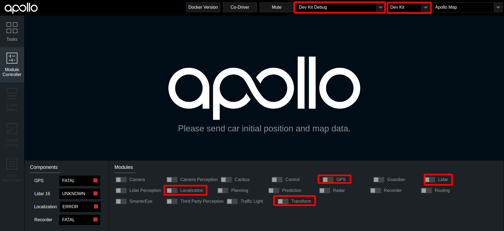
 
####  3. 检查lidar数据是否正确

 - 使用`cyber_monitor`，查看激光雷达数据是否正常输出，并使用上下方向键选择channel，使用右方向键查看channel详细数据，数据无异常则说明激光雷达适配成功
 
- 单激光雷达用户用户，请检查如下channel是否正常输出

  |序号 | channel | 帧率 | 
  |---|---|---|
  |  1 | `/apollo/sensor/lidar16/PointCloud2` | 10Hz |
  |  2 | `/apollo/sensor/lidar16/Scan` | 10Hz |
  |  3 | `/apollo/sensor/lidar16/compensator/PointCloud2` | 10Hz |
 
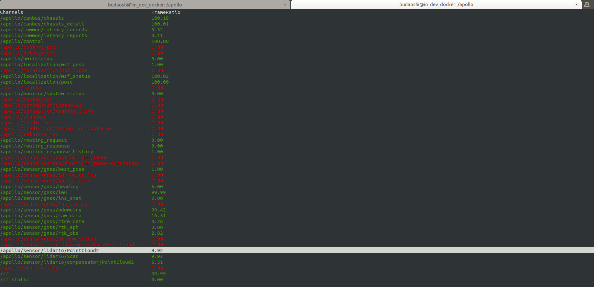

- 三激光雷达用户用户，请检查如下channel是否正常输出

  |序号 | channel | 帧率 | 
  |---|---|---|
  |  1 | `/apollo/sensor/lidar16/back/PointCloud2` | 10Hz |
  |  2 | `/apollo/sensor/lidar16/left/PointCloud2` | 10Hz |
  |  3 | `/apollo/sensor/lidar16/right/PointCloud2` | 10Hz |
  |  4 | `/apollo/sensor/lidar16/fusion/PointCloud2` | 10HZ |
  |  5 | `/apollo/sensor/lidar16/compensator/PointCloud2` | 10Hz |

## 毫米波雷达安装与数据验证(根据自身需求配置)
 **注意：** 在目前的感知方案中，没有融合毫米波雷达数据，对于没有二次开发需求的用户可以不配置毫米波；对于有二次开发需求的用户，可按照本章节内容配置毫米波雷达
 - 毫米波雷达型号：continental AS 408-21
 
 - continental AS 408-21简介：ARS408-21 是大陆 40X 毫米波雷达传感器系列中最新推出的高端产品，可以适用于不同的应用场景。ARS 408-21 很好的处理了测量性能与高安全性之间的矛盾，可实时检测目标的距离并根据当前车速判断是否存在碰撞风险可靠；具有自动故障检测功能，可识别传感器问题，并自动输出故障码鲁棒、轻量化设计；通过使用相对简单的雷达测量技术，以及在汽车行业的深度研发和批量生产基础，可以保证产品鲁棒和轻量化性能。
 
    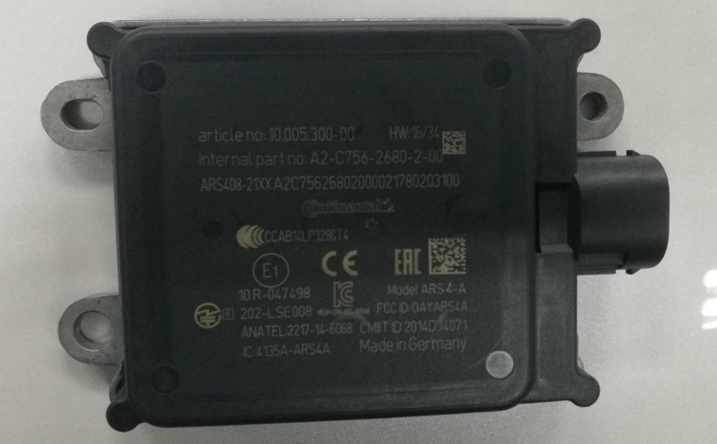

### 毫米波雷达接口及线序

 - continental AS 408-21传感器采用12V直流供电，使用CAN通信接口。使用时，通过如下图所示的连接线缆将传感器CAN通信接口与Apollo的CAN1口连接，电源接口接入12V直流电源(车辆上提供12V电源接线盒)，注意正负极。
 
    
 
 - 传感器接口及定义如下图所示：其中，端口1接12V直流电源；端口8接GND；端口4接CAN_L；端口7接CAN_H。
 
    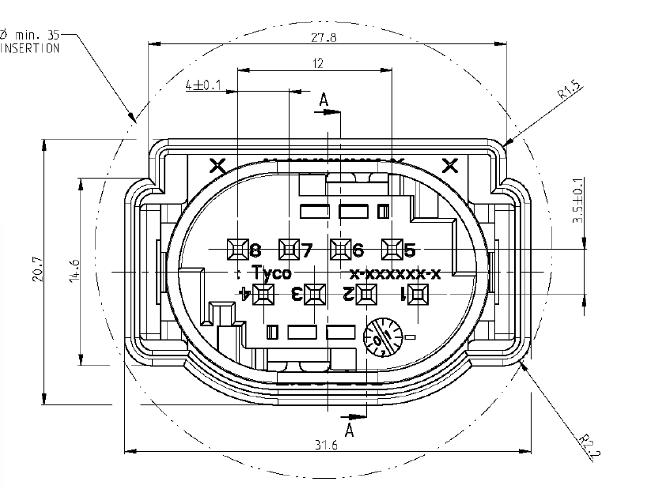
 
     
 
 - 毫米波雷达CAN接口与工控机的CAN1接口连接，如下图所示：
 
     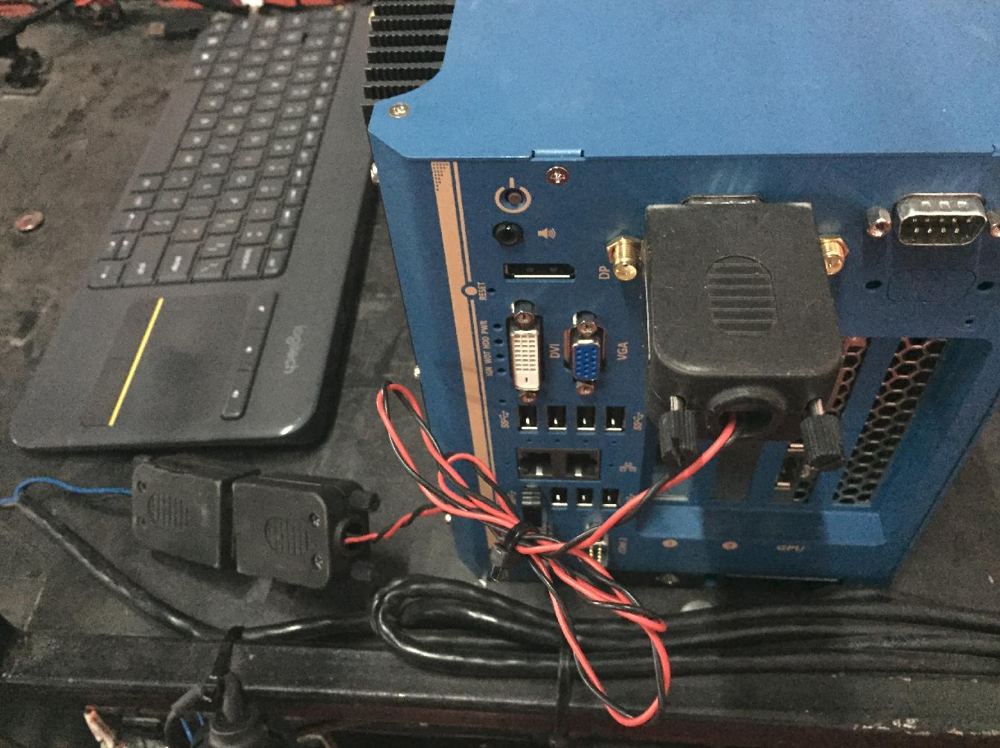
  
### 毫米波雷达的安装固定

 - 传感器应安装在车前方中心处，当人正向面对车辆正前方时，传感器的正面朝向人，传感器的连接口朝向人的右手边，如下图所示：
 
    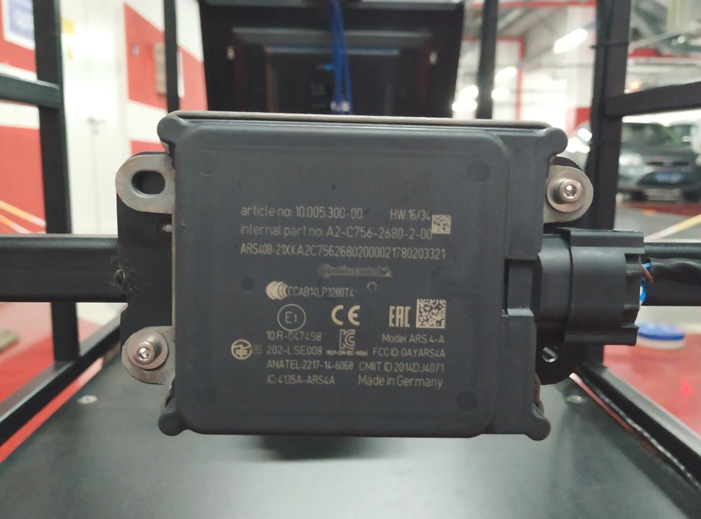
 
    
 
  - 毫米波雷达要牢靠固定在车身上，连接到毫米波雷达的接头要牢靠接插。离地面高0.5米，不能向下倾斜，向上仰0-2度以内，高度误差±0.2米，俯仰角误差0-2度（向上仰小于2度，不能向下倾斜），翻滚角误差±2度（radar左右两侧的平齐程度），航向角误差±2度（radar是否正对前方）。
  
### 毫米波雷达的配置及启动


- 由于只使用了前向毫米波，需要在配置文件modules/drivers/radar/contiradar/dag/conti_radar.dag中删除后向毫米波雷达（rear components）的相关配置，否则，由于后向毫米波雷达使用的can 2，而我们的socket can没有can 2将会导致canbus无法正常启动。修改后的`conti_radar.dag`文件内容如下：


  ```
  module_config {
      module_library : "/apollo/bazel-bin/modules/drivers/radar/conti_radar/libconti_radar.so"
      components {
          class_name : "ContiRadarCanbusComponent"
          config {
              name: "conti_radar_front"
              config_file_path:  "/apollo/modules/drivers/radar/conti_radar/conf/radar_front_conf.pb.txt"
          }
      }
  }
  ```

- 进入can卡目录启动can卡
  
  ```
    cd ~/SocketCan/
    bash start.sh
  ```

- 正确启动Apollo及DreamView，选择模式为`Dev Kit Debug`， 选择车型为`Dev Kit`，并打开`radar`模块开关，如下图所示：

  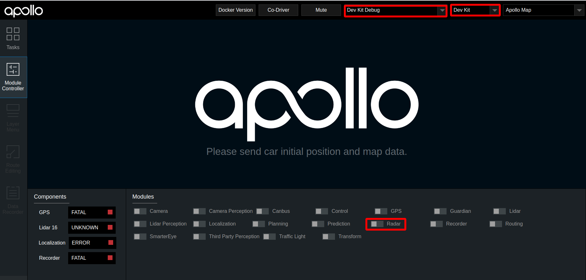

- 使用`cyber_monitor`工具，查看`/apollo/sensor/radar/front`数据

    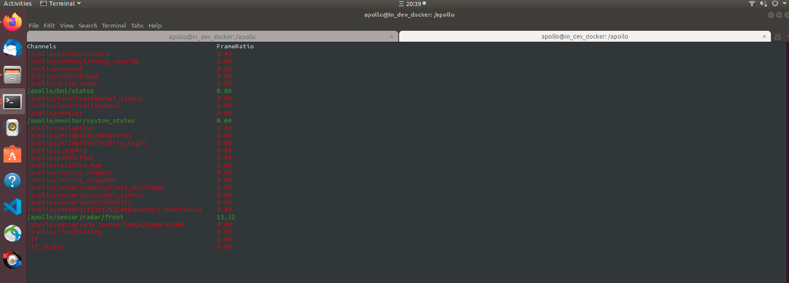
    
    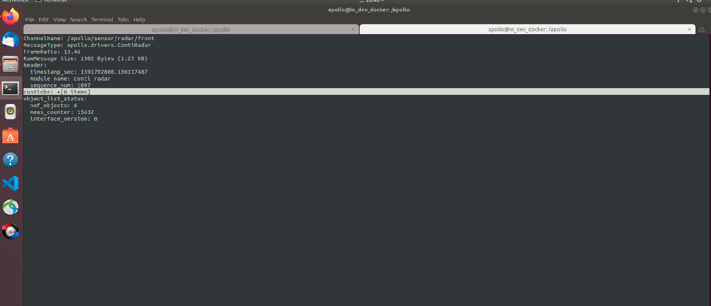
      
    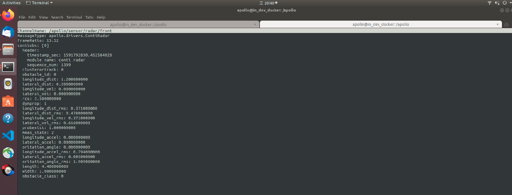

 - 主要参数的含义如下表所示：
 
	|参数 | 含义 | 
	|---|---|
	| `longitude_dist` | 距目标的纵向距离 | 
	| `lateral_dist`   | 距目标的横向距离 | 
	| `longitude_vel`  | 目标的纵向速度   | 
	| `lateral_vel`    |  目标的横向速度  | 
	
### 毫米波雷达数据的验证

 - 纵向距离(`longitude_dist`)/横向距离(`lateral_dist`)的验证：该传感器默认使用`长距离`模式，检测距离为0.2~250m，在车辆正前方检测距离范围内，分别放置障碍物，查看`/apollo/sensor/conti_radar`话题中的`longitute_dist`、`lateral_dist`数据是否正常(单位m)。下图中红色部分为长距离模式下传感器检测范围，误差在+/-0.4m内为正常。
 
    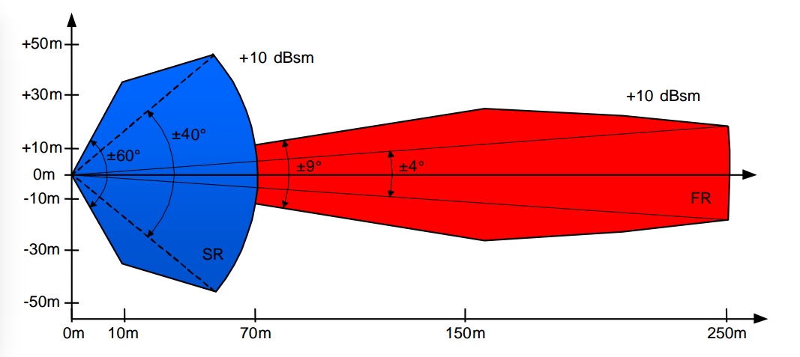

 - 纵向速度(`longitude_vel`)/横向速度(`lateral_vel`)的验证：使得目标物体以固定速度在检测范围内运动，检测数据是否在误差允许有范围内。
 
 - 该传感器各项参数的测量范围及分辨率如下图所示：
 
    

## NEXT
现在，您已经完成激光雷达感知设备集成，接下来可以开始[基于激光雷达的封闭园区自动驾驶搭建--感知设备标定](sensor_calibration_cn.md)
## 常见问题
#### 1. 无法打开Lidar配置网页
一般情况下只要Lidar IP、工控机与Lidar连接的网口IP处于相同号段就可以在浏览器中打开配置网页，如果确认本地IP已经正确修改还不能打开配置页面，请确认Lidar的IP地址是否被修改，可以下载`wireshark`来查看Lidar IP
