# **本文档适用于车辆编号为："2019091-2019095"之间和“2020001之后”的车辆**

**客户车辆铭牌编号为：2019001~2019016的车辆请参考文档**“[底盘Quick_Start_V01](https://github.com/ApolloAuto/apollo/blob/r3.0.0/docs/specs/D-kit/Quick_Start_V01.md)”

**客户车辆铭牌编号为：2019017~2019050的车辆请参考文档**“[底盘Quick_Start_V02](https://github.com/ApolloAuto/apollo/blob/r3.0.0/docs/specs/D-kit/Quick_Start_V02.md)”

**客户车辆铭牌编号为：2019051~2019090的车辆请参考文档**“[底盘Quick_Start_V03](https://github.com/ApolloAuto/apollo/blob/master/docs/specs/D-kit/Quick_Start_V03.md)”

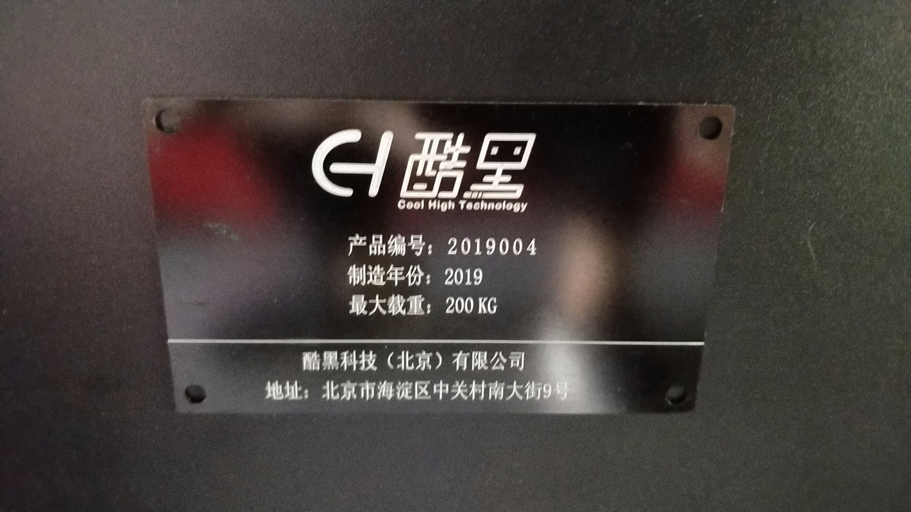

# **快速介绍**

欢迎您选择百度Apollo自动驾驶开发套件(Apollo D-KIT Lite)，请您在收到套件后仔细阅读本文档。此Quick start旨在帮助您快速上手使用套件平台，学会如何操控操作车辆。此文档同时介绍了使用注意事项，旨在确保您安全使用套件的同时延长套件的使用寿命。

# **1. 套件开箱简介**

收到套件后，请您第一时间开箱检查车辆。套件的发货状态如图所示：

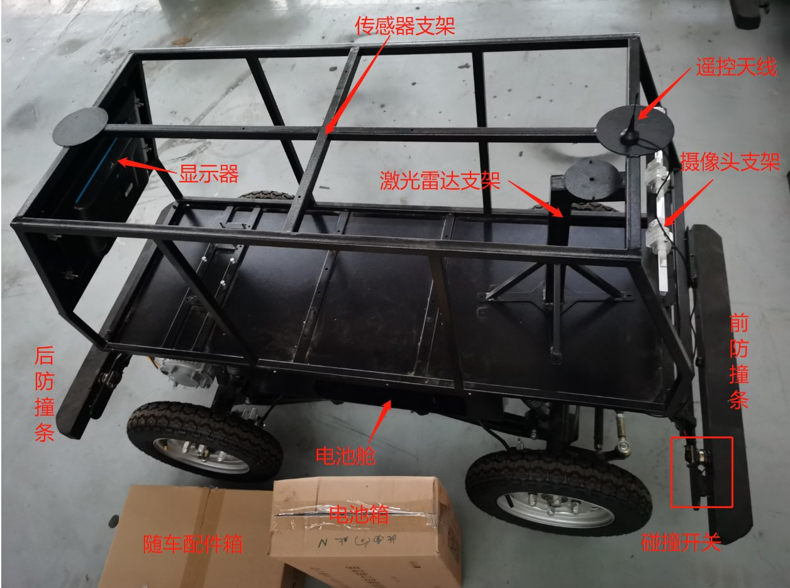

如上图所示，套件在发货时，传感器支架已经与车辆底盘完成固定，并在传感器支架上预装了显示器、摄像头支架。车辆遥控器在“随车配件箱”中，动力电池在电池包装箱中，激光雷达支架如图所示。工控机、激光雷达、毫米波雷达及其他传感器在另外纸箱中。
开箱后，请做以下检查：
|序号|项目|内容|处理|
|---|---|---|---|
|1|车辆外观检查|检查是否有运损|联系百度商务及物流处理|
|2|配件检查|根据配件清单检查是否有错发、漏发以及状态不一致的零件|联系百度商务及售后|

# **1.1 随车配件介绍**

打开随车配件箱，请按照清单核对随车配件。随车配件箱包含内容如下图所示：

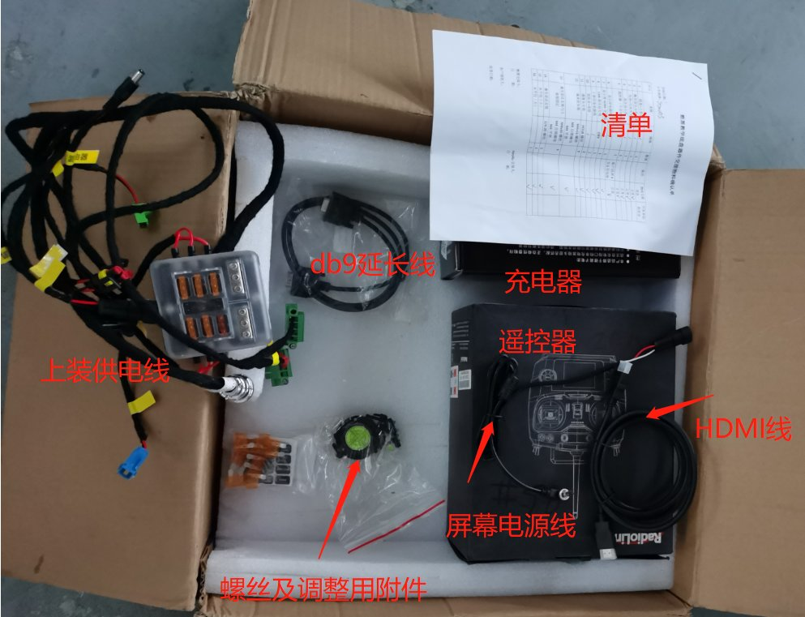

配件及功能介绍如下：
清单   —— 发货清单描述
遥控器 —— 车辆挪车操作（详细操作见后续说明）
充电器 —— 电池充电用 （详细操作见后续说明）
HDMI线——视频数据传输，连接IPC与显示器
DB9延长线——连接工控机CAN0与底盘CAN口/配置IMU时连接工控机与M2
屏幕电源线——显示器供电（一端连显示器，一端连上装供电线）
上装供电线——传感器及工控机供电（连接底盘供电口）
螺丝及调整用附件——传感器及支架固定、摄像头安装调整

# **1.2 随车配件安装集成**

随车配件安装方案详见[Apollo传感器集成说明（点击进入）](./Apollo_D-kit_sensor_integration_V04.md)。

# **2.1 电池介绍**

## **2.1简介**
打开电池箱，如下图所示：

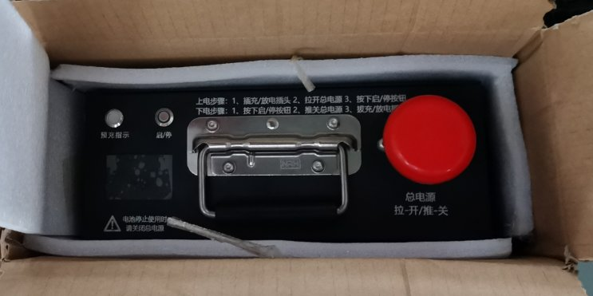

本产品采用的是模块化锂电池组，电池组有正面和侧面两个操作面。侧面布置如图所示：

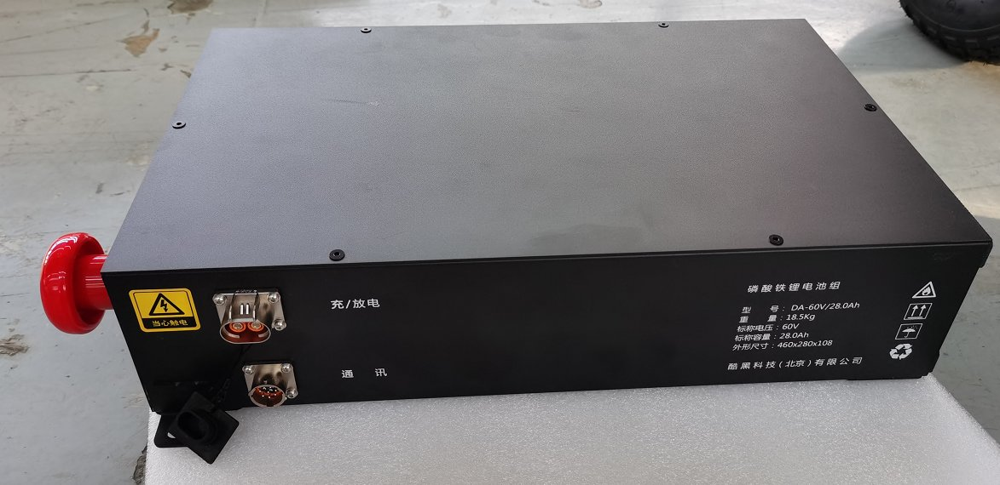
 
电池箱开关拉开时为开启状态，按下时为关闭状态。
取出电池后，请检查电池剩余电量。若电量低于20%，请先充电后再使用。充电方法见后续2.3说明。检查电量方法：拉开电池红色电源开关，按下启停按钮。启停按钮会变绿色，同时液晶显示屏会显示电量百分比。如下图所示：

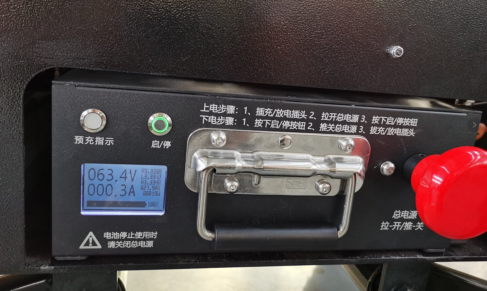

## **2.2取放方式**

电池组安装在底盘右侧的电池舱内部，安装方式如下：
1）确保车辆停放在安全位置，同时电池开关位于关闭位置（红色蘑菇头为按下状态）； 

2）将电池组放入电池仓内（电池较重，操作时注意安全）； 

3）紧固电池固定螺栓；

4）将电缆与相应的高压放电插口和低压通讯插口连接妥当；

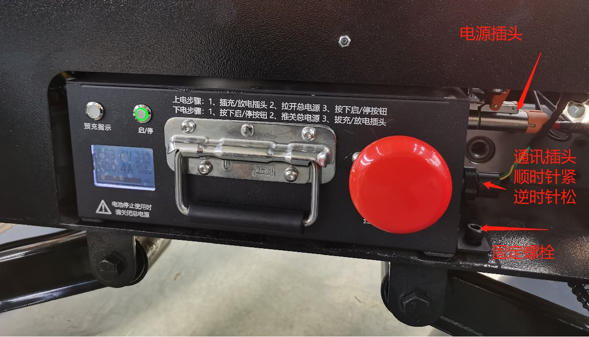 

 如果需要拆卸电池组，步骤相似。

* 警告：在确保全车断电且电池开关处于关闭状态下进行操作。
* 警告：请勿擅自使用其他型号或品牌的电池组，否则可能出现安全风险。
* 警告：请不要在电池出现破损或是故障后继续使用。否则可能导致电池损坏或人员伤亡。
* 警告：电池出现故障或报废后，请合理处置电池，遵守当地法规，否则可能导致严重环境污染。
* 警告：电池显示屏处为电子件散热区，谨防溅水。
* 警告：电池停止使用时请关闭手动开关，切断电源，避免安全隐患。

## **2.3 充电方式及注意事项**   

**充电方式：**

1）请先按照本手册2.2的操作顺序将电池从底盘上拆卸下来；

2）按照以下充电步骤进行充电操作：

充电步骤：先插充电器与电池连接插头，拉电源总开关，按下启/停按钮，再插充电器与插排220V插头；正常充电时，电池屏幕会显示充电中及电量。

下电步骤：先按下启/停按钮，推下电源总开关，拔插充电器与插排220V插头，再拔充电插头。

**警告**

* 警告：充电时，严禁触碰电池组输出端口！
* 警告：本产品严禁在电池组进行供电时进行充电操作！
* 警告：确保只使用原装适配的充电器对电池进行充电，否则有损坏或起火的危险！
* **警告：为保证运行安全及电池寿命，VCU设定的截止放电量为10% SOC，电量低于10%时请不要继续使用。一般测试建议电量低于20%时就断电进行充电操作。**（***电池电量低于10%时，VCU进行低电量保护，此时遥控器不能操作车辆。***）
* 警告：电池需按照2.2电池取放方式拆卸后方可进行充电，禁止在车上直接给电池充电。
* 警告：严禁将电源靠近热源，严禁私自拆装电源。
* 警告：严禁短接，反接电源正负极。
* 警告：电源内部设有保护板及电子线路，注意防水，严禁涉水。
* 警告：在使用、充电或存储期间如发现电源变热、散发气味、变形或其他反常应立即停止使用。
* 警告：零度以下严禁充电。
* 警告：请用专配锂电充电器充电，不匹配充电器可能会带来安全隐患。
* 警告：电池显示屏处为电子件散热区，谨防溅水。
* 警告：电池停止使用时请关闭手动开关，切断电源，避免安全隐患。

## **2.4 上电、断电及急停**

在上电/断电之前，先确保车辆停放在安全位置，请不要将小车停放在斜坡上。断电后小车将失去制动控制能力。

**1）上电**

按照2-2中的指示将电池组装入底盘电池舱；

拉电源总开关，按下启/停按钮，即全车上电。

**2）开启驱动电机使能**

 
向右旋开驱动电机使能开关，即开启驱动电机使能。

需要注意的是，开启驱动电机使能开关时，车辆需要处于N档状态，在遥控模式下关闭电锁键后再开启，是一种常用的将车辆置于N档的方法。

**3）关闭驱动电机使能**

向左旋开驱动电机使能开关，即关闭驱动电机使能。

提示：电机使能开关是为开发者增加的安全操作开关。开关处于关闭状态时，遥控和Apollo的驱动电机指令将不会被执行。此时开发者通过遥控器和Apollo仍可控制车辆转向动作。在调试代码及非驱动测试时，建议将电机使能开关置于关闭状态，以防误碰遥控或误输错误代码导致的车辆突然驱动。

**4）断电**

先按下启/停按钮，推下电源总开关，即可关闭全车电源。

**5）急停**
D-kit底盘的紧急制动分**主动急停控制**和**被动急停控制**。
主动急停控制有**急停按钮**和**遥控器急停**。
急停按钮为为VCU外部控制的最高优先级控制。在车辆出现异常行驶情况时，请优先第一时间按下位于车辆后部的急停按钮。遥控器急停将在3.4节介绍。

前/后碰撞条后的急停开关为被动急停控制。碰撞急停触发2秒后VCU会解除碰撞触发急停控制。

# **3. 遥控器及注意事项**

## **3.1 遥控器介绍**

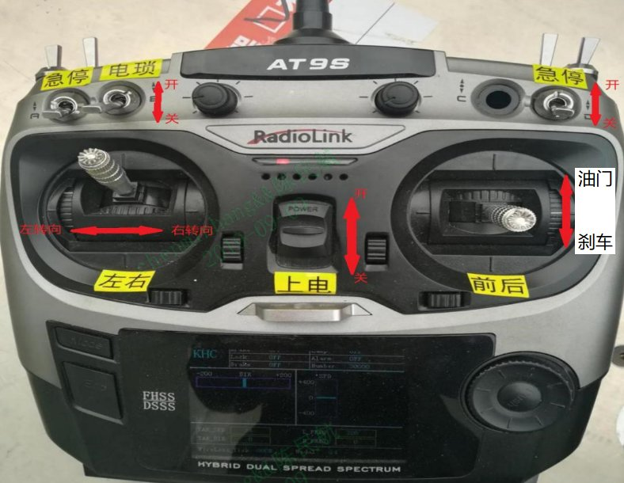

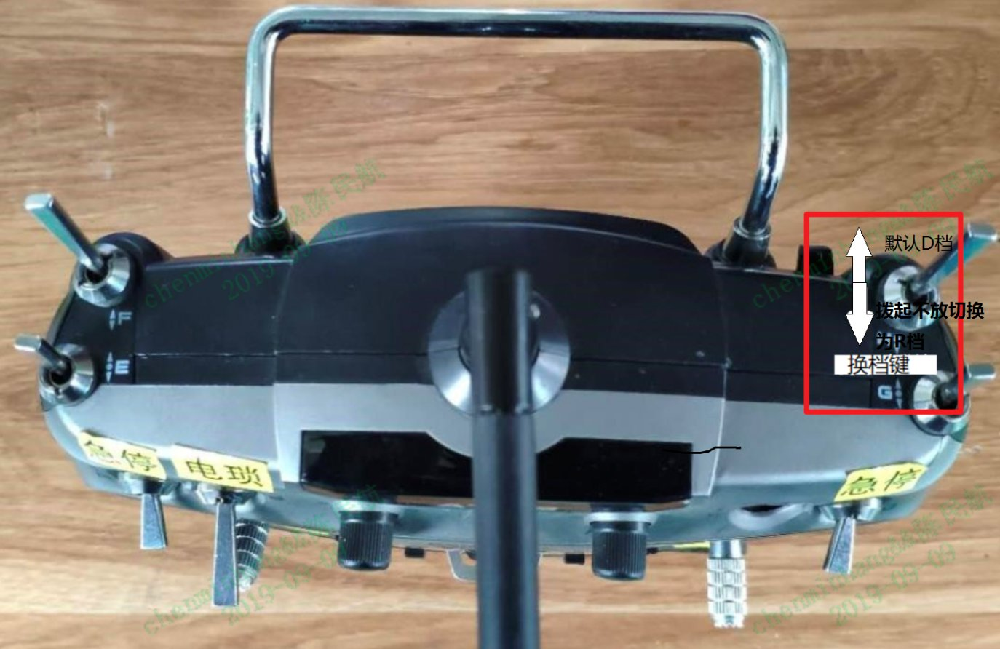

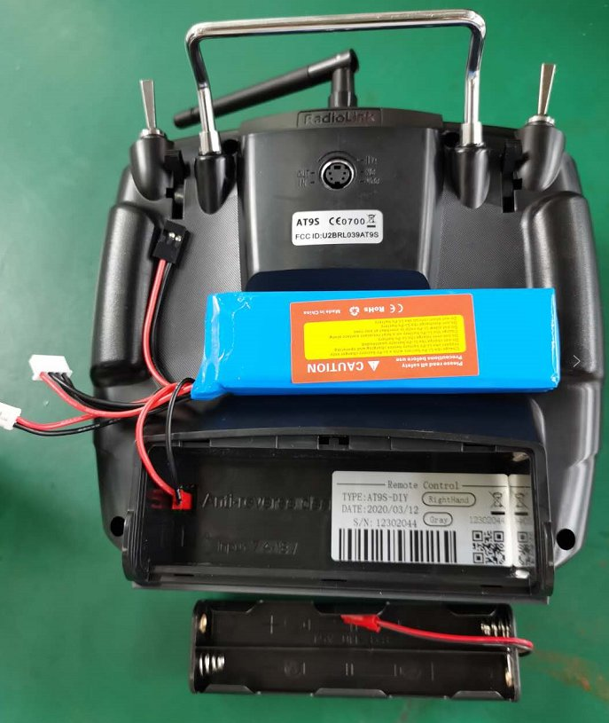

此遥控器采用１２V电源供电，发货配8节5号电池夹，用户可选用８节５号电池供电，也可购买锂电池供电。
此外具有以下控制单元：
* 电源控制开关——power
* 左右控制摇杆——控制左右方向
* 前后控制摇杆——油门/刹车
* 电锁开关——B
* 急停开关——A/D
* 换档开关——H键，拨起不松为换挡；
 * 调试开关——G，正常使用默认位于最下位置，拨起会使遥控器进入调试模式，影响您的正常使用。
按键与屏幕的对照如下图：

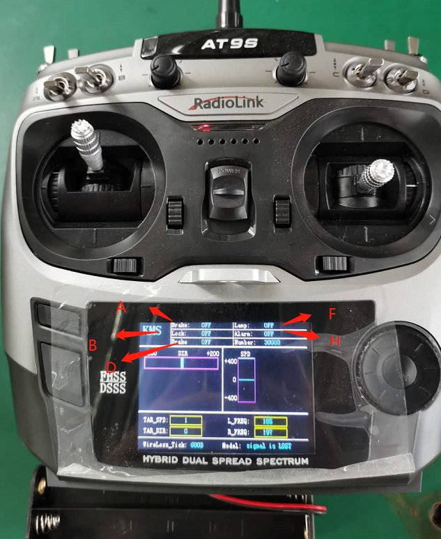

注意：C/E/F目前处于空值状态，G为调试通道开关，操作遥控时默认开关C/E/F/G处于朝下（关闭状态）。
* 警告：出于安全考虑，在遥控器开启电源前请确保所有开关均处于关闭状态。
* 警告：进行电池更换操作前请关闭遥控器电源开关，以免出现危险情况。
* 警告：操作油门/刹车摇杆时，请注意当前档位，以免造成危险。
* 警告：遥控器电池长期不用建议取出，更换电池对接插针时请仔细识别正负。请选用品牌５号电池。劣质５号电池在长时间低功耗使用下，会因内阻不均而导致局部电芯过放，甚至出现漏液或炸裂。若采用锂电池组，请选用合格品牌，及时充电。 
* 警告：遥控器电量不足时，会表现出遥控器上屏幕时暗时亮，在这种情况下，遥控会出现迟滞、不响应等情况，请及时更换电池。

## **3.2 开启和关闭**

**开启：**

### 1）开启遥控器电源

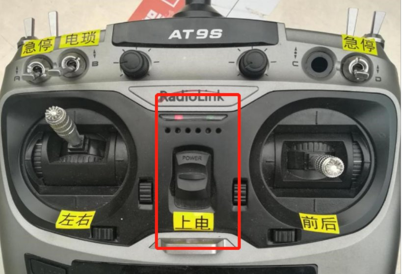

### 2）开启电锁开关 

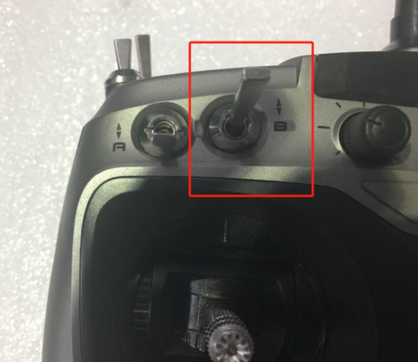

**关闭：**

### 1）先关闭电锁开关

 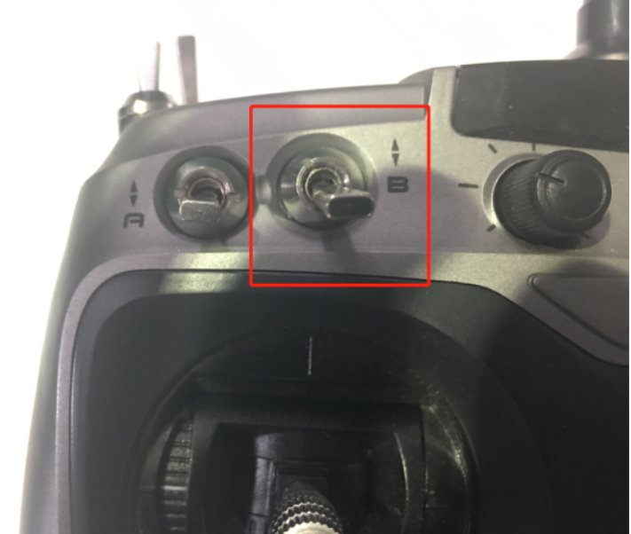

### 2）关闭遥控器电源

 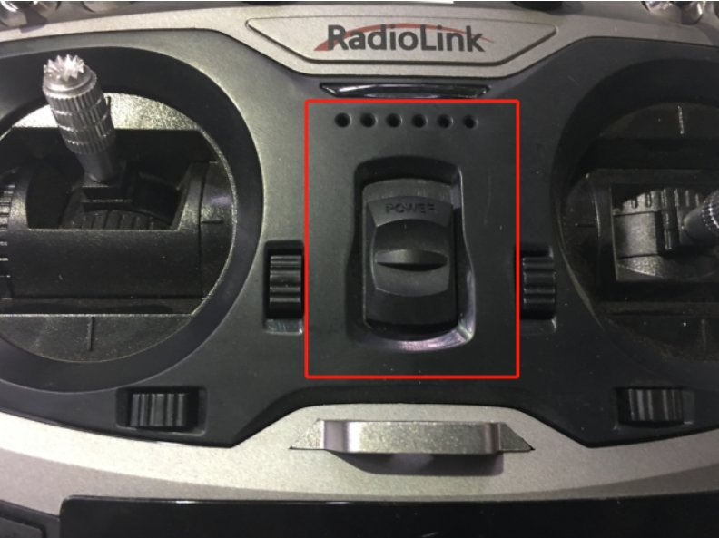

* 提示：此底盘具有检测遥控器信号是否失联的自动保护功能，当底盘发现遥控器在没有关闭电锁的情况下失去信号，底盘会自动刹车；如果关闭遥控器电源先于关闭电锁，会让底盘误以为是遥控器信号失联，也会触发自动刹车保护。

## **3.3 电锁**

电锁为遥控器的第二级开关，只有当电锁开关打开时，底盘才能够接受遥控器的控制，同理，如果车辆运行在自动驾驶模式下，想要使用遥控器接管车辆控制权必须首先打开电锁开关，否则无法接管成功。

## **3.4 急停**

车辆急停由两个串列的急停开关控制，在电锁开关打开的状态下，开启这两个急停开关中的任意一个都将触发急停。
提示：当触发急停时，底盘前进后退控制无效。只有当两个急停开关同时处于关闭状态时，刹车才会释放，使操作人员可以控制车辆。

## **3.5 转向及行进**

车辆的转向及行进由位于控制器中部的两个摇杆控制，在电锁开关打开的状态下，左侧摇杆控制车辆转向方向，右侧摇杆控制车辆前进和后退。
换挡逻辑：默认状态，右侧油门推杆前推为D档，后拉为刹车；H键拨起不放，右侧油门推杆前推为倒挡，后拉为刹车，倒车过程中松开H键会触发急停；缓缓将前后控制摇杆向前推加油，车辆倒车，向后拉前后摇杆刹车

提示：摇杆带有自动回位功能，松开方向摇杆，底盘方向会自动回正；松开前进后退摇杆，底盘会停止运动。

* 警告：出于安全考虑，在人工接管驾驶时，请不要来回拨动遥控杆，避免突然刹车、突然转向等可能导致危险情况的出现。

## **3.6 遥控器安全机制**

为了您的安全，在进入自动驾驶模式前，请务必提前熟悉遥控器的各项操作，尤其关于急停功能的使用，请在每次进入自动驾驶模式前进行遥控操作确认。为了您的安全，我们已在工控机与底层协议层定义了遥控器的绝对优先权，即平台移动的任何状态下（请在每次运行前确保遥控器电量充足），只要遥控器上电且电锁推起，平台即进入人工接管模式，为您的安全测试保驾护航

## **3.7 遥控器安全操作提示**

1）开启遥控器电源前，确保所有按钮都是朝下（关闭状态），待遥控器启动后，旋开车辆急停按钮后，再打开电锁开关接管；

2）进入遥控器模式后，需要试车，即依次对各功能键进行检查，确认无误后方可采用遥控器控制车辆；

3）遥控器操控车辆起步时，请勿一次性将遥控器拨杆推到极限，以免发生危险，应慢慢推动遥控器拨杆，车辆缓缓启动后根据情况适当调节推杆，并时刻注意周围环境，危险情况下及时遥控器急停接管或者按下车辆的急停旋钮；另：遥控器左、右方向摇杆、油门、刹车摇杆需谨慎操作，避免转向、加速或刹车过急；

4）遥控器电量不足时，会表现出遥控器上屏幕时暗时亮，在这种情况下，遥控器控制车会出现迟滞、不响应等情况，请及时更换电池；

5）操作时如感觉遥控器异常，立即停车，如遇紧急情况时，立即使用紧急制动按钮停车；

6）临时停车状态下要养成打开急停开关的好习惯（A/D），长时间停车要按下车辆的急停按钮；

7）出于安全考虑，任何人在进行遥控器的操作前都应该仔细阅读相关说明和注意事项，请不要将遥控器交给不熟悉相关操作的人员使用，以免发生危险。 

8）在车辆退出遥控控制模式前，需确保车辆在完全停止状态下，再退出；

9）由于该开发套件没有ABS防抱死系统，如果标定时出现车轮抱死现象，会导致标定采集数据无效，操作时一定要注意遥控器的操控，标定取值时也要注意X，Y，Z值的合理组合。

# **４. 使用场景限制**

请参考产品手册。

# **５. 车辆安全机制**

## **５.1 限速保护**

无论自动驾驶模式或是遥控驾驶模式，ECU会将车速限制在一个比较安全的范围。小车的最高速度被限制为前进20km/h，后退10km/h，以防止严重的碰撞事故（为了实验安全，遥控或线控超出该速度范围会直接触发急停予以警告）。正常测试使用建议车速在~10km/h。
注意：安全起见，遥控驾驶车辆时建议最好将车速控制在10km/h左右，并时刻注意危险情况，随时做好接管准备，正常测试建议遥控器专人负责。

## **５.2 遥控接管优先级定义**

当车辆处于自动驾驶模式时，如果出现偏离航向、车速过快或者有碰撞风险时，可以直接使用遥控器接管车辆的控制，遥控器所发出的控制指令的优先级永远高于自动驾驶系统所给出的控制指令，详细操作见4-1。

## **５.3 急停开关**

急停开关位于车辆后方左下方，其实际位置如下图红框所示：

 

                                    图6.1 急停开关实际位置图
当车辆在自动驾驶模式中有碰撞风险且无法使用遥控器时，随车人员可以根据实际情况选择拍下急停开关来实现全车制动，有效规避风险。

* 提示：急停开关被拍下后，车轮将会抱死，遥控器的指令也将无法对车辆进行操控，必须要在旋开急停开关以后，才能继续进行操作。

## **５.4 碰撞保护**

车辆前后分别有一条防撞条，能够感应防撞条与车体间的压力从而判断是否发生了碰撞。当发生轻微碰撞时，碰撞保护触点开关感受到压力就会立即解除动力，并会出发刹车，待车停稳后自动复位，以防进一步伤害。此外，防撞条本身也能形成有效的隔离，一定程度上保护车辆和被撞物体。
 
# **６. 常见问题及解决方法**

**Q：车辆不启动怎么办？**

A：首先请检测电池组是否为有电，电池组安装是否正确（包括接线是否正确），之后检查车辆是否正确上电。如经过上述操作仍无法启动，请在Apollo开发套件QA微信群反馈，会有相关技术人员为您跟进。

**Q：控制器长鸣是什么问题？**

A：出现控制器上电后长鸣现象，请确认急停开关是否开启，如急停开关已打开，依然长鸣一般为制动管路有泄露导致制动油压压力不足，控制器无法通过初始化安全自检，不能进入工作状态，可更换刹车油重启尝试。如确认制动管路正常且控制器依然长鸣，请在Apollo开发套件QA微信群反馈，会有相关技术人员为您跟进。

**Q：车辆不响应遥控指令怎么办？**

A：首先检查遥控器的两个急停开关是否处在关闭位置，然后检查遥控器电源开关是否处于开启位置，检查遥控器是否有电以及电锁开关是否处在开启位置。如上述操作后仍不能解决问题，请在Apollo开发套件QA微信群反馈，会有相关技术人员为您跟进。

**Q：底盘上电车辆无自检动作，显示屏不亮，工控机不工作怎么办？**

A：首先检查，车端供电插头是否跟电池放电端连接妥当，然后检查急停或者防撞是否工作，如果没反应，用万用表测量车尾部圆形航插中1# 2# 脚之间和3# 4# 脚之间的电压（正常1# 2#脚之间的电压为12V，3# 4# 脚之间的电压为24V），如测量无电压，可能是底盘内DCDC模块损坏，请联系售后人员。

# **７. 日常保养和维护**

## **７.1 清洁和存储**

1）底盘及车架如有灰尘或是污渍，可以用湿布进行擦拭；其它上装传感器器件也可以用同样的方式进行清洁，但是需要在擦拭过后用干布擦去表面的水分。
2）摄像头在不使用时需要确保盖上相机盖，以免灰尘影响图像质量。
3）请勿随意使用酒精、汽油、煤油或其他具有腐蚀性、挥发性的溶剂对各个部位进行清洁。这些物质可能会损坏车体结构或是内部部件。
4）在进行清洁前，请确保车辆已经正确断电（断开电池电源开关或电池已取下），否则可能导致漏电、触电的后果。
5）不使用时，请将车辆放在阴凉、干燥的位置，并用防尘罩进行遮蔽。请不要将车长时间存放在户外，过冷和过热都会对器件的寿命产生影响。

## **７.2 电池**

1）不要将电池组放置在超过 50℃的高温或低于 -20℃的低温环境中（例如，请勿将其电池组放在夏天曝晒下的汽车中）。
2）请避免电池过放电，尽量即充即用，这样可大大延长电池的使用寿命。另外，在常温下使用，电池组可发挥较高的续航里程和性能。
3）为了避免电池过放，每隔1个月对电池进行充电和放电。如长时间存放，将电池拆卸，并保持间隔1个月的充放电操作。

4）电池要轻拿轻放，谨防撞坏！

提示：禁止拆开电池箱本体，否则可能因电击或短路导致严重安全事故！电池如有问题，请及时联系售后人员。

## **７.3 车体部件**

1）建议每隔1年更换一次制动液。并定期向底盘车轴、轮轴等位置补加润滑油。
2）每隔一段时间，请对轮胎胎压进行检查；胎压过低时，请及时补足气压或是更换轮胎。
3）请不要在胎压过低甚至轮胎漏气的情况下启动车辆进行任何作业，以免产生不必要的危险。

## **７.4 安全注意事项**

1）请不要随意拆卸传感器支架；严禁带电操作，如：插拔线束或用手触摸制动，转向以及其他运动机构；如有特殊需求，请联系售后人员。

2）请不要随意加装更改电路，如有特殊需求，请联系售后人员。

4）车尾圆形航插不使用时请用橡胶盖盖住，请勿用手触摸。

## **８ 免责声明**

1）. 本手册在印刷时已尽可能的包含各项功能介绍和使用说明。但由于产品功能不断完善、设计变更等，仍可能与您购买的产品有不符之处。由于产品更新，本手册与实际产品在颜色、外观等方面可能有所偏差，请以实际产品为准。 
2）. 为保护用户的合法权益，请您在使用本产品前务必仔细阅读我们随附本产品提供的说明书。套件提供商保留对上述文档进行更新的权利。请您务必按照说明书和安全须知操作本产品。 
3）. 本产品不适合未满18周岁及其他不具备完全民事行为能力的人士使用，请您避免上述人士接触本产品，在有上述人士出现的场合操作时请您格外注意。 
4）. 一旦开始使用本产品，即视为您已阅读、理解、认可和接受本产品的说明书、免责声明的全部条款和内容。使用者承诺对自已的行为及因此而产生的所有后果负责。 
5）. 在使用本产品的过程中，请您务必严格遵守并执行包括但不限于说明书里的要求。对于违反说明书所提示的使用行为或不可抗因素导致的一切人身伤害、事故、财产损失、法律纠纷，及其他一切造成利益冲突的不利事件，均由用户自己承担相关责任和损失，套件提供商将不承担任何责任。 
6）. 用户使用本产品直接或间接发生的任何违反法律规定的行为，套件提供商将不承担任何责任。
