# 循迹搭建--车辆循迹演示

- [循迹搭建--车辆循迹演示](#循迹搭建--车辆循迹演示)
  - [概览](#概览)
  - [前提条件](#前提条件)
  - [车辆配置文件准备](#车辆配置文件准备)
  - [循迹启动](#循迹启动)
    - [1. 启动can卡](#1-启动can卡)
    - [2. 编译项目，启动Dreamview](#2-编译项目启动dreamview)
    - [3. 启动所需模块](#3-启动所需模块)
    - [4. 检查各模块数据是否正确](#4-检查各模块数据是否正确)
    - [5. 循迹录制](#5-循迹录制)
    - [6. 循迹回放](#6-循迹回放)
    - [7. 再次循迹](#7-再次循迹)
  - [调试](#调试)
    - [1. 底盘连接是否正常](#1-底盘连接是否正常)
    - [2. canbus_teleop的使用](#2-canbus_teleop的使用)
  - [常见问题](#常见问题)
    - [1. 网络断开或者网络太差无法进入docker](#1-网络断开或者网络太差无法进入docker)
    - [2. 无法控制汽车底盘和读取底盘信号](#2-无法控制汽车底盘和读取底盘信号)
    - [3. Teleop进入不了自动驾驶模式](#3-teleop进入不了自动驾驶模式)
    - [4. chassis_detail不显示](#4-chassis_detail不显示)
    - [5. apollo系统第一次搭建完毕，测试发转角车辆实际转角不对](#5-apollo系统第一次搭建完毕测试发转角车辆实际转角不对)
    - [6.循迹回放中，点击`Start Auto`开始后，车辆不动](#6循迹回放中点击start-auto开始后车辆不动)
    - [7.循迹刹车地点不准确，或者刹车停不下来](#7循迹刹车地点不准确或者刹车停不下来)
    - [8.循迹效果不佳](#8循迹效果不佳)


## 概览

- 该用户手册旨在帮助用户在开发套件上实现循迹功能。
- 循迹作为自动驾驶的最小闭环子集，在硬件上需要搭建自动驾驶最小系统的集成，在软件上实现相关模块的配置、标定、启动等工作，才能进行循迹的操作演示。在循迹过程中，既考验开发者在前述准备工作的掌握程度，又能够很直观的感受到自动驾驶的使用体验。

## 前提条件

1. 在进行车辆循迹前，需要完成以下前提工作：

- [循迹搭建--车辆集成](vehicle_integration_cn.md)
- [循迹搭建--Apollo系统安装](apollo_installation_cn.md)
- [循迹搭建--定位模块配置](localization_configuration_cn.md)
- [循迹搭建--车辆动力学云标定](vehicle_calibration_online_cn.md)

2. 确保在开阔场地、车少人少等相对安全的情况下实验。

3. 确保至少两人操作，一人操作工控机，一人操作遥控器，做好随时接管准备。

## 车辆配置文件准备

- 在`/apollo/modules/calibration/data/`目录下列出了Apollo支持车型的配置参数。
- 在`/apollo/modules/calibration/data/`文件夹下，我们为开发套件提供了默认的参数，请务必按照前述**前提条件**的步骤进行配置，否则会导致循迹启动失败。在完成前提条件准备工作后，下面开始启动循迹操作。

## 循迹启动

### 1. 启动can卡

启动工控机后，首先进入CAN卡目录启动CAN驱动，在桌面上打开命令行终端（`Terminal`），操作如下命令

    cd ~/SocketCan/
    bash start.sh

正确操作后，会返回如下显示，证明CAN驱动启动成功：


### 2. 编译项目，启动Dreamview
进入docker环境，用gpu编译项目，启动DreamView

    cd /apollo
    bash docker/scripts/dev_start.sh
    bash docker/scripts/dev_into.sh
    bash apollo.sh build_opt_gpu
    bash scripts/bootstrap.sh

### 3. 启动所需模块

在浏览器中打开`(http://localhost:8888)`，在`--setup mode--`内，选择模式为`Rtk`， 在`--vehicle--`选择车型，根据车辆铭牌信息选择对应的车型(见下表)，如使用Apollo D-KIT Lite，则在`--vehicle--`选择车型`Dev Kit`。

  | 铭牌信息 | 选择车型 |
  |---|---|
  | Apollo D-KIT Lite | dev_kit |
  | Apollo D-KIT Standard | dev_kit_standard |
  | Apollo D-KIT Advanced(NE-B) | dev_kit_advanced_ne-b |
  | Apollo D-KIT Advanced(NE-S) | dev_kit_advanced_ne-s |
  | Apollo D-KIT Advanced(SNE-R) | dev_kit_advanced_sne-r |

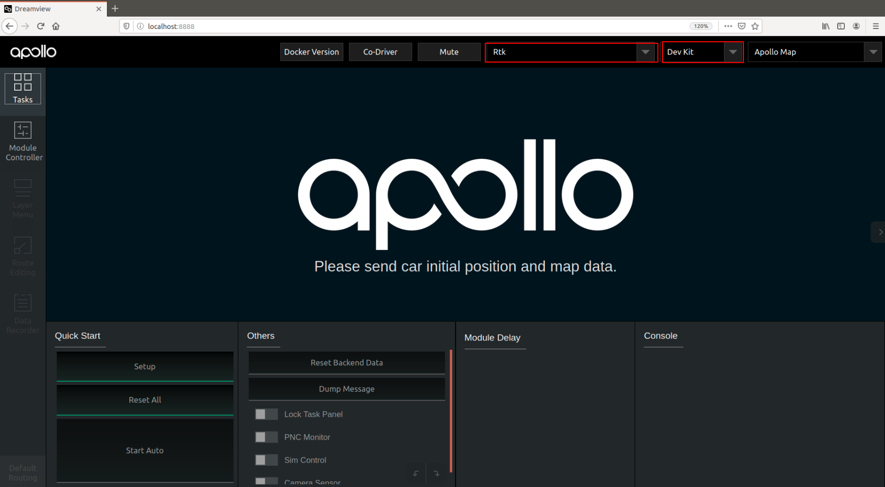

在页面左上角处点击`Module Controller`页面标签，进入到软件模块启动界面，
点击侧启动Canbus模块、GPS模块、Localization模块：

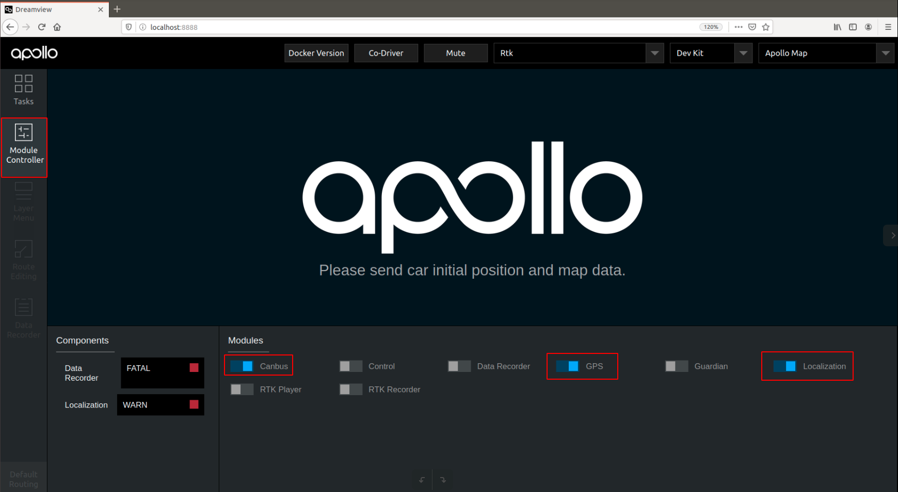

### 4. 检查各模块数据是否正确

在docker中输入`cyber_monitor`命令并检查以下channel（使用`上下方向键`选择channel，使用`右方向键`查看channel详细信息。关于cyber_monitor更详细使用，请参考[CyberRT_Developer_Tools](../../cyber/CyberRT_Developer_Tools.md)）：

|channel_name | 检查项目 |
|---|---|
|`/apollo/canbus/chassis`|确保能正常输出数据|
|`/apollo/canbus/chassis_detail`|确保能正常输出数据|
|`/apollo/sensor/gnss/best_pose` | 确保能正常输出数据、`sol_type:` 选项显示为`NARROW_INT`|
|`/apollo/localization/pose`| 确保能正常输出数据 |

如下图所示

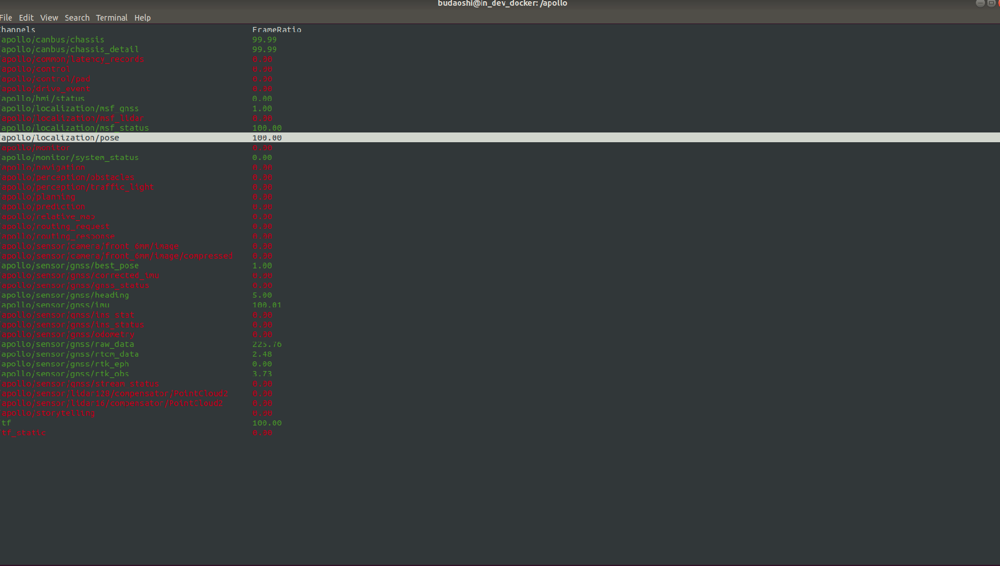

### 5. 循迹录制

1）在空旷场地内，将车辆遥控至循迹起点，记录此时车辆车头方向和所在位置：

- 将**遥控器**按钮置于`手动驾驶模式`；

- 记录此时车辆起点位置；

**注:** 可以在车辆左前轮处画一个十字符号，记录车辆的起点。

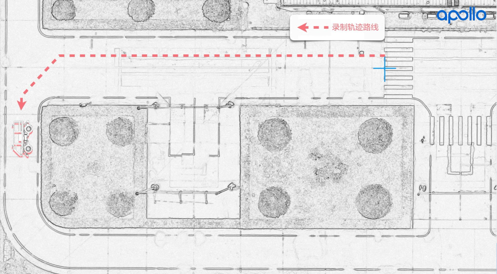

2）启动`Rtk_Recorder`录制循迹数据：

- 在`Dreamview`页面内，在`Module Controller`，点击`RTK Recorder`按钮，启动循迹录制，录制循迹数据：

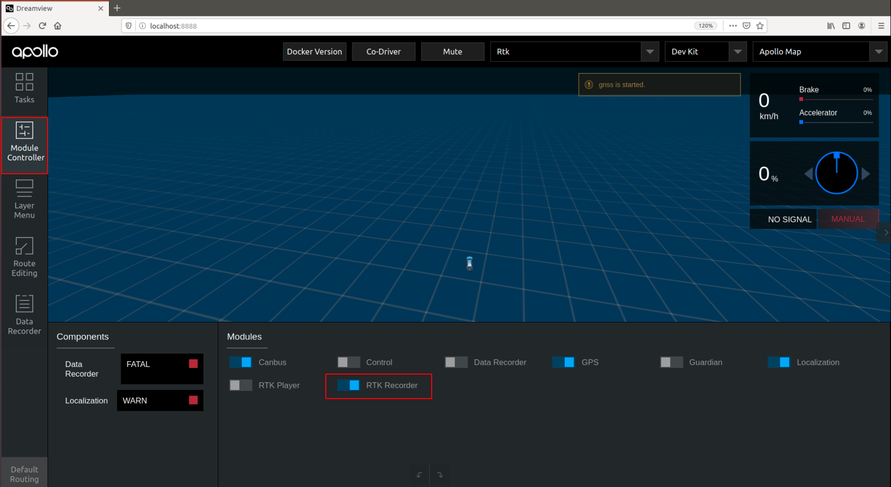

- 这时使用**遥控器**，遥控车辆**前进**一段轨迹，到达期望的终点，车辆停止后，在`Dreamview`页面点击`RTK Recorder`按钮，关闭循迹数据录制。

- **注意**：请务必在车辆到达终点后快速关闭`RTK Recorder`按钮，否则可能会导致记录多余无用数据，或者只打开不关闭`RTK Recorder`按钮，可能会导致后续循迹回放无法进行！

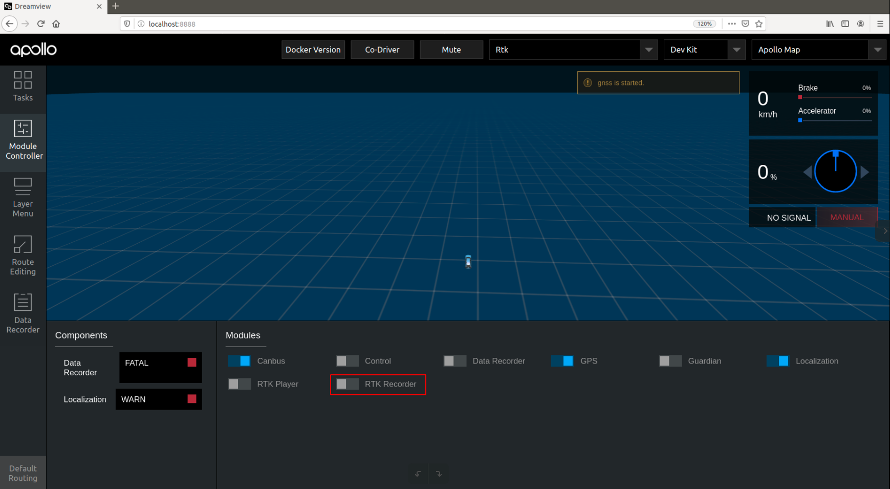

- 结束录制循迹轨迹后，录制的循迹数据在`apollo/data/log/garage.csv`中，文件内包含了车辆的轨迹、速度、加速度、曲率、档位、油门、刹车、转向等信息。

### 6. 循迹回放

1）将车辆移动至之前循迹录制时标记的起点：
- 注意车辆的**起点位置**和**车头朝向**都尽量与循迹录制时起点保持一致；
- **遥控器放权**。

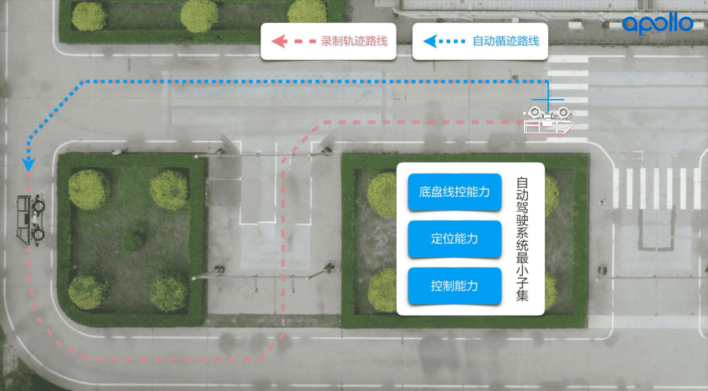

2）启动`Rtk_Player`进行循迹回放：

- 启动`control`模块：在`Dreamview`页面`Module Controller`标签页内，点击`Control`按钮，启动`control`模块。

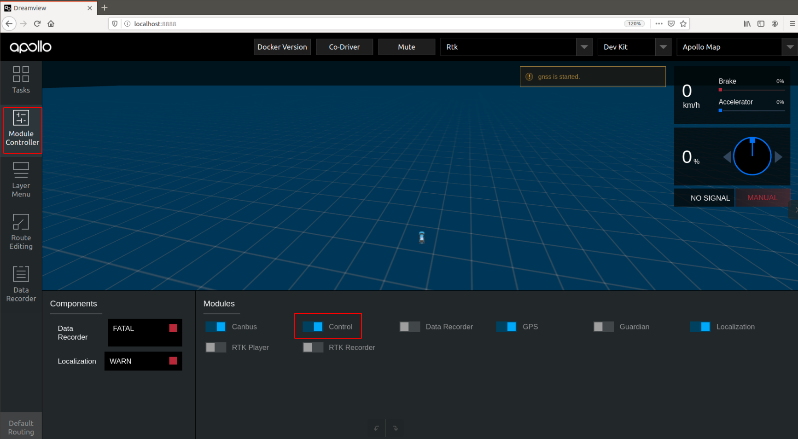

- 点击`Rtk Player`按钮，启动循迹回放，这时会看到车辆前方出现一条蓝色的轨迹线，这条轨迹线就是刚才循迹录制的那条轨迹线；


- **第一次尝试循迹时**，先检查`dreamview`是否有清晰无毛刺的蓝色规划轨迹，请确认轨迹是否与期望的大致相符，如果相差很大，比如本来录制的是直行，而蓝色轨迹显示的大幅度转弯，此时要小心测试，谨防危险。

- 这时**车辆还不会进入自动驾驶**，这一步只是把循迹数据放出来，如果车辆没有前进，则会不断`replan`。

3）然后在`Dreamview`中`Task`标签内，点击`Start Auto`，这时候车辆开始启动，可能开始起步比较猛，多注意接管。

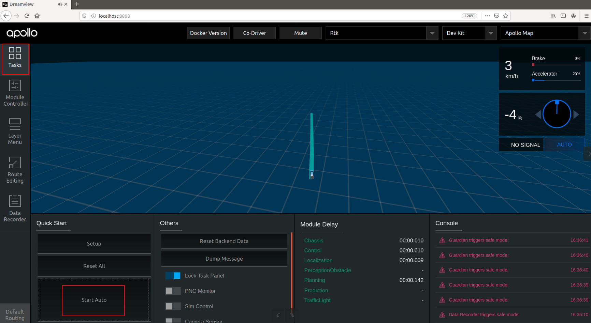

4）车辆循迹自动驾驶至终点后，车辆停止，**这时使用遥控器首先接管车辆**，然后在`Dreamview`页面`Module Controller`标签页内，再次点击`Rtk Player`按钮关闭循迹回放。


**注意事项**：一定要在宽阔的场地进行测试，确保周围没有人，循迹测试之前做好应急接管准备，有问题随时遥控器接管。不要轻易尝试速度大于4m/s（16km/h）的循迹。

5）记录循迹自动驾驶`Record数据包`，可以在第（3）步开始钱，在`Dreamview`页面`Module Controller`标签页内，点击`Data Recorder`按钮，录制循迹自动驾驶的`Record数据包`，车辆循迹结束后，**记得再次点击`Data Recorder`按钮关闭录制**（**注意**：如果只打开不关闭，可能会导致录制的数据包不完整，造成后续使用该数据包失败！），该数据包可以用于后续在实验室查看循迹数据、回放循迹来使用。

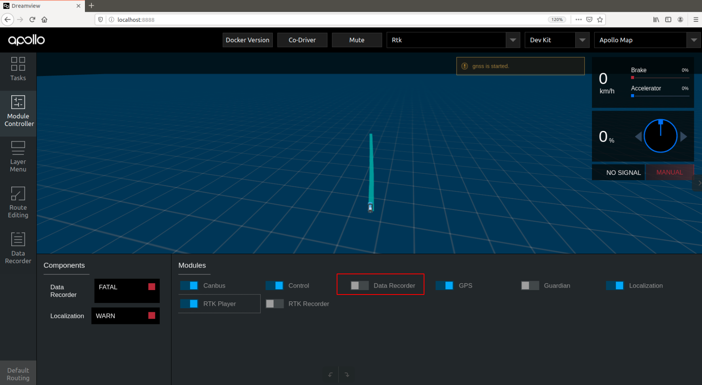

- 录制的`Record数据包`存储在`/apollo/data/bag`目录中，每一次的录制数据包会存储在以时间戳命名的文件夹内，（**注意**：数据包会在`apollo/data/bag/`文件夹下生成2个`年月日时分秒相似`的文件夹，分别以`年-月-日-时-分-秒`和`年-月-日-时-分-秒_s`命名，开发者可以不用理会`_s`后缀的文件夹，只需要使用`年-月-日-时-分-秒`文件夹内录制的标定数据即可）。

### 7. 再次循迹

如果想再次循迹其它轨迹路径，可以重复**步骤5-6**，完成不同轨迹的循迹演示。


## 调试

### 1. 底盘连接是否正常
 
硬件连接：确保CAN硬件连接线CAN0和车辆线控底盘连接正常，进入`apollo docker`环境，输入以下命令：

```
cd /apollo/scripts
bash bootstrap.sh
bash canbus.sh  //启动canbus模块
cyber_monitor
```

在cyber_monitor界面中应该能看到如下的模块：

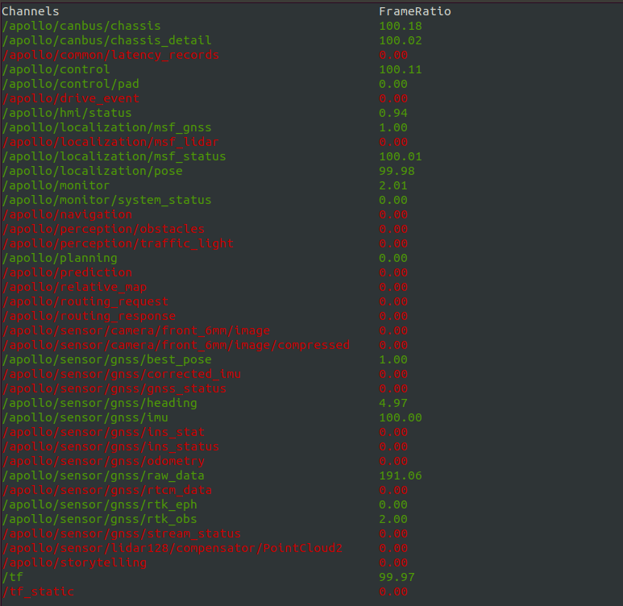

用键盘上下箭头移动光标选择`chassis`或者`chassis_detail`，选中后按右箭头可以进入查看详细信息，这些信息即是车辆底盘信息，`chassis`消息如下： 

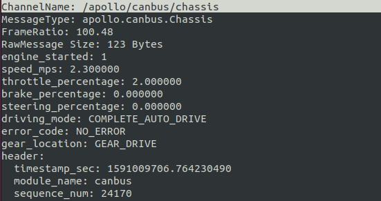 

`chassis detail`消息如下：

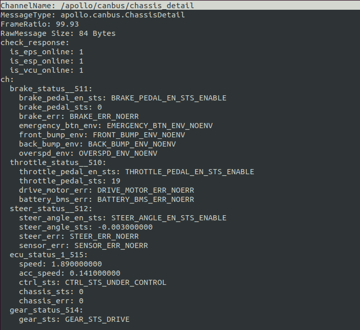 

如果这些信息得到正确显示，说明CANBUS模块工作正常。如果不能显示底盘信息，很大可能是CANBUS有问题，或者底盘有问题，没有向上反馈底盘数据。 
保证CANBUS的连接正确性，才能确定工控机计算单元可以控制车辆底盘，才能继续其它部分的调试。 
 
### 2. canbus_teleop的使用
 
CANBUS能够连接底盘后，我们可以尝试控制底盘的运动。如果控制正常，则说明工控机计算单元下发命令后得到正确执行。 进入Ubuntu Docker环境，输入以下命令：

```
cd /apollo/scripts 
bash canbus_teleop.sh 
```

弹出界面如下： 

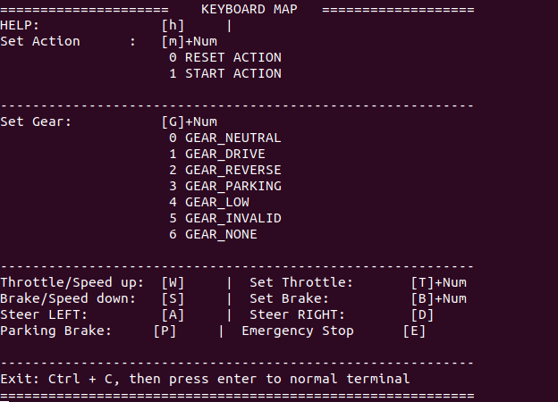 
 
a 根据提示按`m0`重置系统，按`m1`是开始控制底盘。
b 按几次`a`或者`d`，看看车轮是否转动。 
c 按`g1`，挂前进档，按几次`w`，看车辆是否前进，按几次`s`看车辆是否停下来。 
请小心测试，不要轻易长时间连续按键，以防车辆突然高速动作发生事故。

 
## 常见问题

调试过程中，常见的问题及解决办法总结如下：

### 1. 网络断开或者网络太差无法进入docker
报错如下：


主要是因为网络没有连接上，或者网络太慢，请检查网路。

可以执行`bash docker/scripts/dev_start.sh -n`，`-n`参数表示不联网下载`docker image`更新，直接使用本地镜像。

### 2. 无法控制汽车底盘和读取底盘信号

具体表现是车辆下发油门转向等信号，底盘不执行，也读不到底盘的相关信息，这时候的原因应该是CAN不通。解决方法如下：

1）查看CAN线硬件是否连接合适；

2）如果（1）已经正确，但问题还存在，查看启动canbus前是否在`docker`外是否启动`SocketCAN`启动脚本`start.sh`；

3）如果（2）已经正确，但问题还存在，查看`apollo/data/log/canbus.INFO`是否有报错信息；

4）如果（3）尝试了，仍然没有解决，用CAN调试工具，看底盘是否有信号上报，以及apollo执行的时候，是否有命令下发。

### 3. Teleop进入不了自动驾驶模式 

 打开`canbus.sh`后，执行`canbus_teleop.sh`始终无法进入自动驾驶模式，CAN调试工具测量底盘信号是通的。这种情况，有可能是guidian模块打开造成，guidian模块是一种安全保护机制，开发者调试阶段，可以根据需要关掉。
 打开`/apollo/module/canbus/conf/canbus.conf`：
 修改`--receive_guardian`为`--noreceive_guardian`。

### 4. chassis_detail不显示

1）查看`dreamview`内否选择了`Dev_Kit`车型，如果不确认可以先选择其它车型后，重新选择`Dev_Kit`；

2）查看canbus配置文件`/apollo/module/canbus/conf/canbus.conf`内是否打开chassis_detail，如没有打开，把`--noenable_chassis_detail_pub`修改为`enable_chassis_detail_pub`，重启`canbus`后生效。

3）是否正确启动CAN驱动，查看启动canbus前是否在`docker`外是否启动`SocketCAN`启动脚本`start.sh`。

4）查看硬件CAN线接口有没有松动。

### 5. apollo系统第一次搭建完毕，测试发转角车辆实际转角不对

例如下发转向角10%，但是转动角度远超过转向最大角度的10%，可以在cyber_monitor中查看 /apollo/canbus/chassis及时观察底盘信号，apollo默认是Lincoln车型，如果使用者第一次搭建好apollo，还没有选择车型那么默认会按照`mkz_example`车型的最大转向角乘以百分比去执行。解决方法如下：检查modules/canbus/conf/canbus_conf.pb.txt中的配置，brand设置为正确的车型（例如`CH`），重启canbus，再尝试。如何仍然未解决，请运行bootstrap.sh脚本，在dreamview中选择对应的车型，选择`Dev Kit`开发套件，然后再执行前述步骤检查转角是否正确。

### 6.循迹回放中，点击`Start Auto`开始后，车辆不动

1）查看遥控器是否放权


### 7.循迹刹车地点不准确，或者刹车停不下来

很可能是标定没有做好，标定刹车部分没有做好，急刹缓刹都要考虑。

### 8.循迹效果不佳

纵向效果不好，请考虑标定表和PID参数调整以及车辆本身的信号（例如油门和刹车下发和上报是否一致），横向误差大，主要考虑LQR参数调整和车辆转向信号（下发和上报是否一致）。
