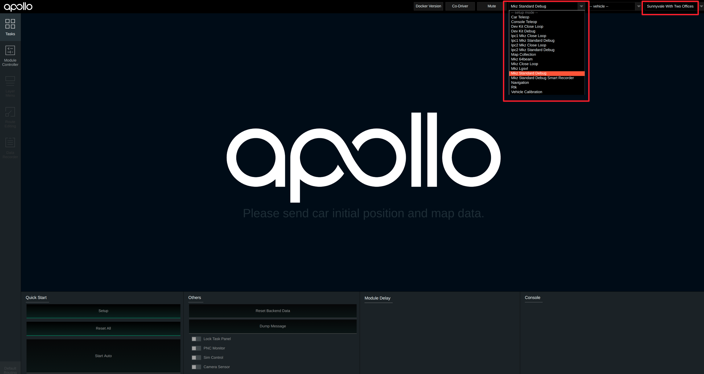
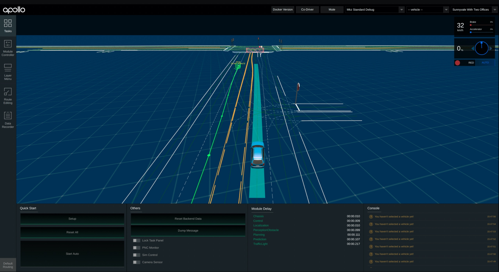

# How to Launch and Run Apollo

## Build Apollo

First check to make sure you are in development docker container before you
proceed. Make sure nVidia GPU is available and that you have installed the
appropriate nVidia driver if you want to run the entire system. You could still
proceed with the next few steps if no nVidia GPU is available, the system will
run without perception as it was CUDA-based.

```
# Make sure you start up clean
./apollo.sh clean

# This will build the full system and requires nVidia GPU with nVidia drivers
# loaded. If no GPU is availabe, please run "./apollo.sh build_opt" instead.
./apollo.sh build_opt_gpu
```

**Note**:

> Please run `./apollo.sh build_fe` before `./apollo.sh build_opt` if you made
> any modifications to the Dreamview frontend.

## Run Apollo

Once you have finished building Apollo, follow the steps below to launch it.
Note that although `bootstrap.sh` may succeed, the Web UI won't be ready if the
former building step was skipped.

### Start Apollo

Running `scripts/bootstrap.sh` will start Dreamview backend with the monitor
module enabled.

```
# Startup modules monitor and dreamview, the default option is start.
./scripts/bootstrap.sh [start | stop | restart]
```

### Access Dreamview Web UI

Open [http://localhost:8888](http://localhost:8888) in your favorite browser,
e.g. Chrome, and you should see this screen. However, no module(s) except
monitor is running in the background at this moment.


### Select Drive Mode and Map

From the dropdown box of Mode Setup, select "Mkz Standard Debug" mode. From the
dropdown box of Map, select "Sunnyvale with Two Offices".



### Replay Demo Record

To see if the system works, use the demo record to "feed" the system.

```
# You need to download the demo record using the following commands
cd docs/demo_guide/
python3 record_helper.py demo_3.5.record

# You can now replay this demo "record" in a loop with the '-l' flag
cyber_recorder play -f docs/demo_guide/demo_3.5.record -l
```

Dreamview should show a running vehicle now. (The following image might be
different due to frontend code changes.)



### Congrats!

You have successfully built Apollo! Now you can revisit
[Apollo Readme](../../README.md) for additional guidelines on the neccessary
hardware setup.
