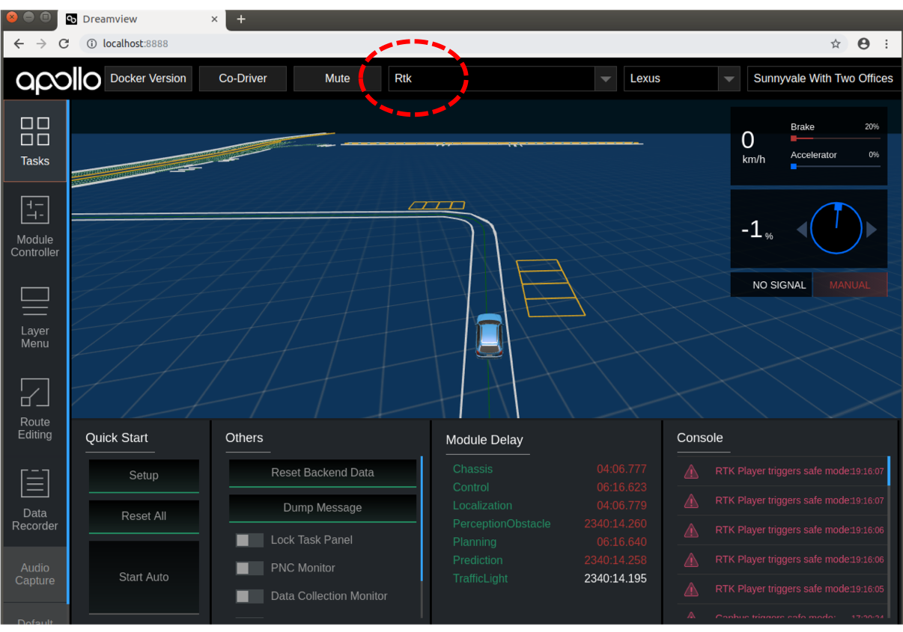
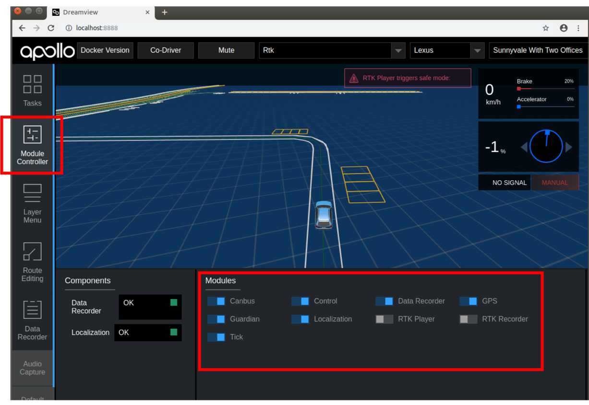
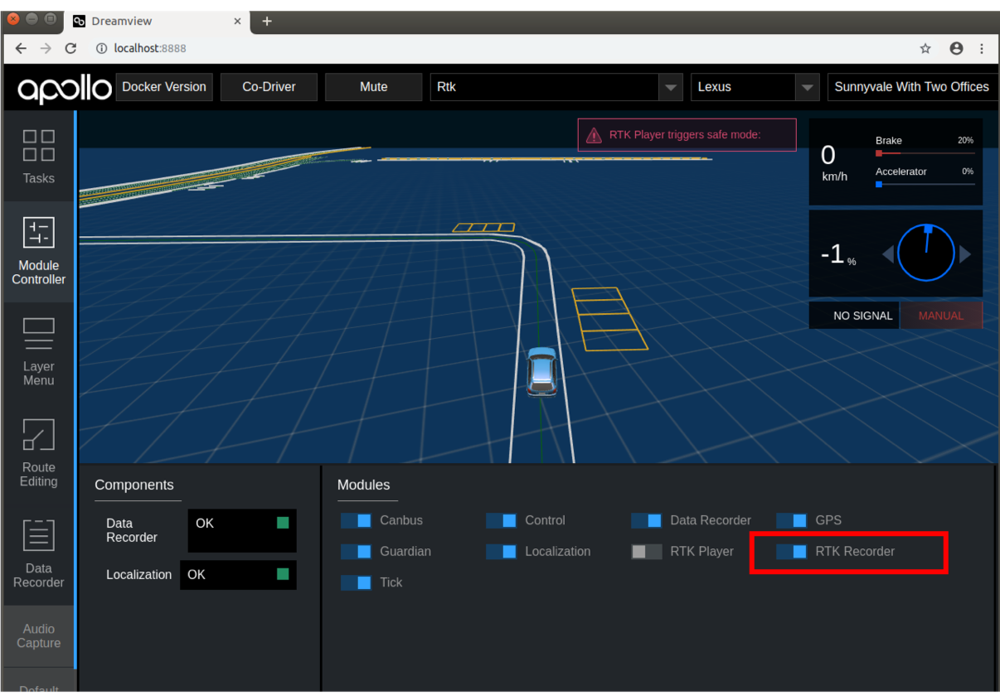
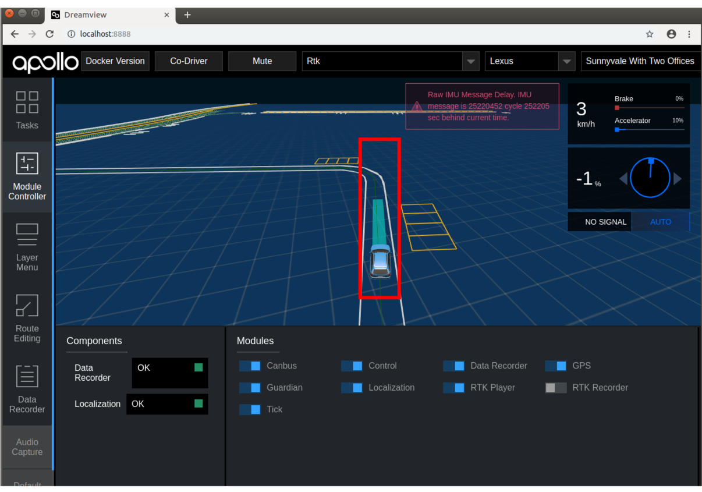

# How to Leverage Apollo's RTK mode

RTK mode helps developers and partners to better test your perception and control modules without needing to check the planning decisions.  

## Process to use RTK Mode
 
### Step 1: Mode Selection

1. Build Apollo and Launch DreamView on http://localhost:8888

2. Set the mode as `RTK`, and select the vehicle type and map for your specific case



### Step 2: Module Initialization

1. Select `Module Controller` from the left-side of Dreamview

2. Enable all modules under the RTK mode except `RTK Player` and `RTK Recorder` from the bottom right-hand side of the window

3. Under the Components section, pause until the `Data Recorder` and `Localization` both display `OK` status.

```
Note: to activate the localization module with accurate position signal shown on the Dreamview, the driver may need to manually drive the car around your parking lot several times.
```



### Step 3: Enable RTK Recorder

1. Drive the car to the beginning of the desired testing path. The car should currently be in `Manual` mode.

2. Enable the `RTK recorder`.  
From this moment on, Dreamview enters the `Path Recording` mode



### Step 4: Manual Path Generation

1. Manually drive the car along the desired test path. This path will be recorded automatically

2. After reaching the end of the desired path, it is important to remember that you must disable the `RTK Recorder` module before anything else

3. Manually drive back to the initial position with both `RTK Player` and `RTK Recorder` off.

### Step 5: Enabling RTK Player

1. Enable the `RTK player`. The driver should be able to see the recorded path trajectory

2. The driver can then decide if he needs to adjust the car's position to record the path better

3. Once ready, the driver may click on `Start Auto`, and the car will be expected to track the recorded path automatically

```Note:

Start Auto refers to putting the car into autonomous mode. This can be done by putting the car in neutral and clicking on the Start Auto button present in the Tasks window.

```

4. When path tracking is complete, the driver may disable the `RTK player` or directly return back to the start point for the second/third/…  run if applied



```
Note:
The blue line in the above image is the recorded path
```

###

1. The recorded path will be never be cleared unless you re-record the path, so feel free to repeat the auto-mode path-tracking tests as many times as you may need

2. If a new path is needed, simply repeat steps 3 - 5 to record the new path. The newly recorded path will overwrite the old path automatically. 

