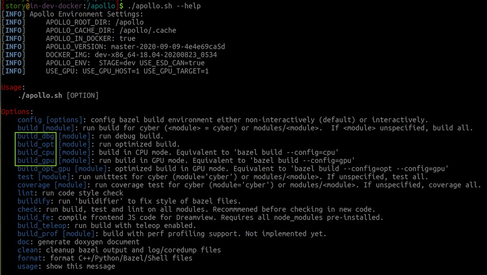
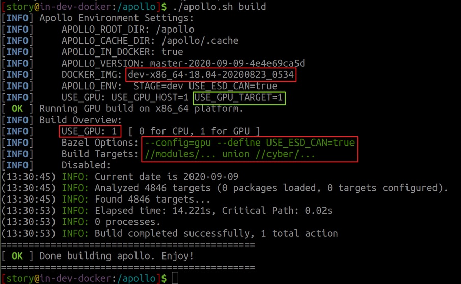

# Apollo Build and Test Explained

This document focuses on how to build and test Apollo in different ways.

## Pre-requisites

You are supposed to have followed
[Apollo Software Installation Guide](../quickstart/apollo_software_installation_guide.md).
Make sure you are in Apollo development Docker container before you proceed.

## Overview

Apollo uses [Bazel](https://bazel.build) as its underlying build system. Bazel
is an open-source build and test tool with a human-readable, high-level build
language suitable for medium and large projects. Basically, the better you know
about Bazel, the better you know about Apollo Build.

## Building Apollo

### Subcommands in `apollo.sh`

Let's first take a look at the usage of `apollo.sh`.



From this message, we can see subcommands that starts with "build\_", like
`build_dbg`, `build_cpu`, and `build_opt_gpu`, etc. As you may figure out, they
are all variants for their basic form: `apollo.sh build`.

### Building Apollo using `apollo.sh build`

You can use `./apollo.sh build` to build individual modules, or the whole Apollo
project.

Type the following command to build, say, Cyber RT:

```bash
bash apollo.sh build cyber
```

To build the whole Planning module (all
[targets](https://docs.bazel.build/versions/master/guide.html#target-patterns)
under the `modules/planning` directory):

```bash
bash apollo.sh build planning
```

To build everything,

```bash
bash apollo.sh build
```

 For simplicty, Apollo 6.0 introduces the notion
of `bash apollo.sh build [module]` to replace the notion of `build_cyber`,
`build_planning`, etc in previous Apollo releases.

### Variants of `apollo.sh build`

There are mainly four variants of `apollo.sh build`, namely, `build_dbg`,
`build_opt`, `build_cpu` and `build_gpu`.

You may ask, what's the differences among them?

Good question. Let me try to make this clear.

#### Debug v.s. Optimized Build: `build_dbg/build_opt`

By default, Apollo uses the
[fastbuild compilation mode](https://docs.bazel.build/versions/master/user-manual.html#flag--compilation_mode)
. So when you type `bash apollo.sh build planning`, you are indicating Bazel to
run:

```bash
bazel build [other options] -c fastbuild //modules/planning/...
```

for you.

When you type `bash apollo.sh build_dbg planning`, you are running

```bash
bazel build [other options] --config=dbg //modules/planning/...
```

Please note that `--config=dbg` implies `-c dbg`, as can be seen from the
following section from `tools/bazelrc`:

```
build:dbg -c dbg
build:opt -c opt
```

Now you can understand the `build_opt` variant. Basically,

```bash
bash apollo.sh build_opt cyber
```

means

```bash
bazel build [other options] -c opt //cyber/...
```

#### CPU v.s. GPU Build: `build_cpu/build_gpu`

By now, you can easily figure out that `build_cpu` and `build_gpu` are just
another form of running

```bash
bazel build --config=cpu
```

and

```bash
bazel build --config=gpu
```

respectively under the hood.

However, things are a bit complicated compared to the `build_dbg/build_gpu`
case.

Here is a snapshot showing the log messages on my screen when running
`apollo.sh build`:



There are three `USE_GPU`: `USE_GPU_HOST`, `USE_GPU_TARGET` and `USE_GPU`.

- `USE_GPU_HOST` is an environment variable determined by
  `docker/scripts/dev_start.sh` to pass to Apollo Docker container, which
  indicates whether the host machine (where Docker is running) is GPU capable.
- `USE_GPU_TARGET` is an environment variable determined by
  `scripts/apollo.bashrc` inside Docker container to indicate whether the
  container is GPU capable.
- `USE_GPU` is a variable indicating whether to perform CPU build or GPU build.

When you type `bash apollo.sh build --config=cpu` or
`apollo.sh build --config=gpu`, the
[build script](../../scripts/apollo_build.sh)
will check the GPU capability of the Docker container and determines whether the
build you specified can succeed.

 If you didn't specify whether to perform CPU or
GPU build, the build script will determine it automatically according to GPU
capability of your Docker environment.

 It's OK to run CPU build in a **GPU capable**
Apollo container, whereas running GPU build in a CPU-only container will fail.

 By design, `--config=cpu` and `--config=gpu`
are mutually exclusive. You should specify at most one of them when running
`apollo.sh build`.

#### Optimized GPU Build with `build_opt_gpu`

`build_opt_gpu` is just the combination of `build_opt` and `build_gpu`.

```
bash apollo.sh build_opt_gpu
```

is equivalent to

```
bazel build --config=opt --config=gpu //...
```

## Running Unit Tests: `apollo.sh test`

Since `bazel test` inherits all options from `bazel build` (Ref:
[Bazel Docs:Test Options](https://docs.bazel.build/versions/master/command-line-reference.html#test-options)),
the discussions above are applicable to `apollo.sh test`.

```bash
# Each of the following pairs are basically equivalent:

# Run unit tests under the `cyber` directory
bash apollo.sh test cyber
bazel test [--config=cpu|--config=gpu] //cyber/...

# Run unit tests for all in CPU mode
bash apollo.sh test --config=cpu
bazel test --config=cpu //...

# Run unit tests for the Planning module in GPU mode
bash apollo.sh test --config=gpu planning
bazel test --config=gpu //modules/planning/...
```

 Actually, `apollo.sh test` is equivalent to

```bash
bazel test --config=unit_test
```

All the `cpplint` targets was excluded, since there is an independent
`apollo.sh lint` command.

## Running Code Coverage using `apollo.sh coverage`

Since `bazel coverage` inherits all options from `bazel test`(See
[Bazel Docs: Coverage Options](https://docs.bazel.build/versions/master/command-line-reference.html#coverage-options)),
all the discussions about `apollo.sh test` applies to `apollo.sh coverage`.

## Build/Test/Coverage: An Insider's View

Under the hood, `apollo.sh build/test/coverage` makes use of
[scripts/apollo_build.sh](../../scripts/apollo_build.sh),
[scripts/apollo_test.sh](../../scripts/apollo_test.sh),
and
[scripts/apollo_coverage.sh](../../scripts/apollo_coverage.sh)
respectively.

If you are familiar with Bazel, you can build/test any fine-grained target(s).
For example,

```bash
bazel test -c dbg //cyber/common:file_test
bazel build --config=opt //modules/dreamview/backend
bazel test --config=gpu  //modules/localization/...
```
